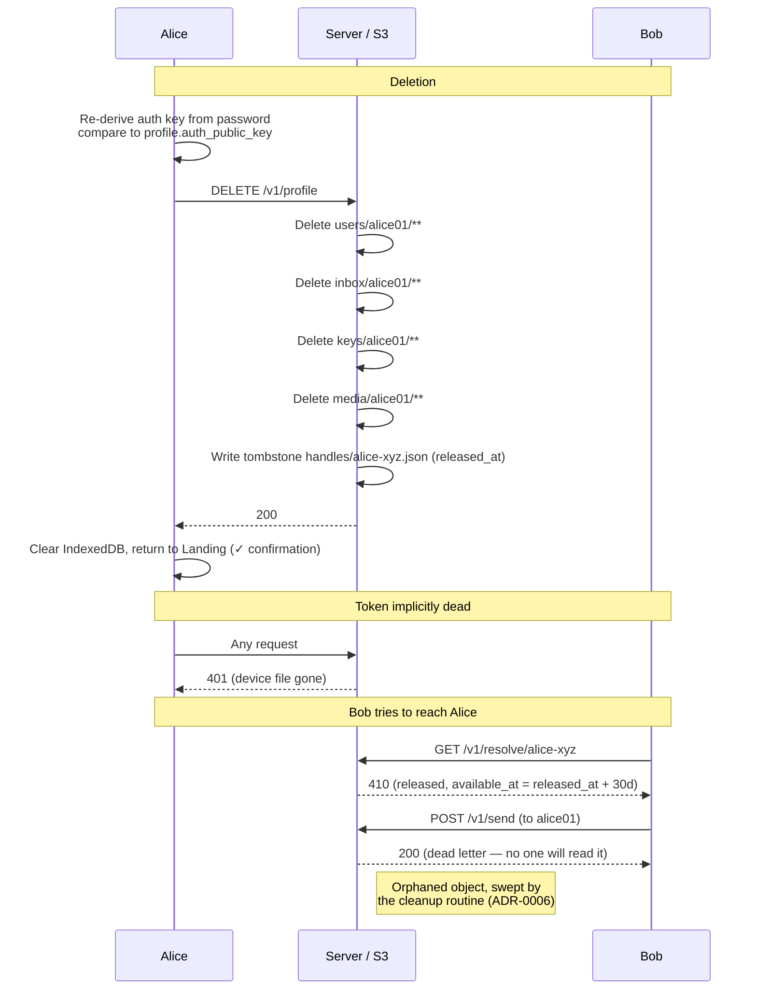

# Scenario: Account deletion

Alice decides to leave the service and deletes her account from
Settings → Danger zone. All her data is removed; her handle is kept as a
30-day cooldown tombstone (ADR-0013) rather than deleted outright.

**Prerequisite**: [Profile and contacts](./profile-and-contacts.md) completed.

## Overview


Alice has a profile with display name, avatar, contacts, messages, and key backups.

## Cast

- **Alice** — deletes her account
- **Bob** — tries to reach Alice after deletion

## Starting S3 state

```
users/alice01/profile.json
users/alice01/contacts.json
users/alice01/devices/adev01.json
users/alice01/devices/adev02.json

handles/alice-xyz.json

inbox/alice01/live/msg001..msg009
inbox/alice01/archive/2026-02-15-{ULID}   ← compacted archive

keys/alice01/live/S1
keys/alice01/live/S2
keys/alice01/archive/2026-02-15-{ULID}

media/alice01/avatar/abc123.jpg
```

## 1. Alice confirms deletion (client-side)

Alice opens Settings → Danger zone → "Delete account", which expands into a
confirmation form. To proceed she must:

1. **Enter her password.** The client reads her own `profile.json` for the
   salt + KDF params, re-derives the Argon2id secret → auth keypair, and
   compares the derived auth public key against `profile.auth_public_key`
   (the same cryptographic gate as change-password, ADR-0011). A wrong
   password fails **locally** — no server round-trip — so a stolen unlocked
   device can't delete the account, and the password never leaves the device.
2. **Type her handle** (`alice-xyz`) to confirm — GitHub-style, defeating
   reflexive click-through.
3. **Acknowledge** "this cannot be undone" via a checkbox.

Only with all three does the destructive call fire. No server call happens
during this step.

## 2. Alice deletes her account

```
DELETE /v1/profile
→ 200
```

Server logic:
1. Reads `users/alice01/profile.json` to get `handle: "alice-xyz"`.
2. Lists and deletes all objects under `users/alice01/`.
3. Lists and deletes all objects under `inbox/alice01/`.
4. Lists and deletes all objects under `keys/alice01/`.
5. Lists and deletes all objects under `media/alice01/`.
6. **Overwrites** `handles/alice-xyz.json` with a tombstone
   (`{released_at: <now>}`) under the per-handle mutex — reserving it for the
   30-day cooldown rather than deleting it (ADR-0013 § *Deleted-handle
   cooldown*). The mutex serialises against any in-flight registration on the
   same handle.

S3 state after: all per-user prefixes are gone; the handle remains as a
tombstone.

The client wipes IndexedDB (`clearSession`), drops the in-memory session, and
navigates to Landing, where a one-shot **"✓ Your account has been deleted."**
confirmation appears (auto-dismisses after 5s; gone on refresh).

## 3. Alice's token is implicitly invalidated

Alice's token is still cryptographically valid (HMAC-based, stateless), but
subsequent requests fail because:

- `requireAuth` calls `HeadObject` on `users/alice01/devices/adev01.json`
- The device file no longer exists → 401

No explicit token revocation needed.

### Multi-device propagation

Alice's *other* devices (e.g. `adev02`) still hold a local session, but their
device file is gone. Their next authenticated request `HeadObject`s a missing
`users/alice01/devices/adev02.json` → 401 → the existing `unauthorized`
auth-event handler wipes local state and routes to `/login`, where the handle
now resolves as released. No special-casing — account deletion rides the same
path as device revocation.

## 4. Bob tries to resolve Alice's handle

```
GET /v1/resolve/alice-xyz
→ 410 { "released_at": "...", "available_at": "<released_at + 30d>" }
```

Bob's client shows "That account was deleted" (the same released-handle UX the
login form already implements). The handle `alice-xyz` is **not** immediately
re-registrable: during the cooldown a registration attempt is rejected with the
"in cooldown until YYYY-MM-DD" indicator. This is symmetric — not even Alice can
re-claim it until the window elapses. After 30 days (or once the
[cleanup routine](./README.md) sweeps the expired tombstone) the handle is free.

## 5. Bob sends a message to Alice's user ID

If Bob's client still has Alice's `user_id` cached:

```
POST /v1/send
{
  "envelopes": [
    { "to_user": "alice01", ..., "msg_id": "msg010", ... }
  ]
}
→ 200
```

The server writes `inbox/alice01/live/msg010`. This is a dead letter — no one
will ever read it. The next cleanup cycle (ADR-0006) will garbage-collect
orphaned inbox objects for users with no profile.

**Note**: the server does not validate that `to_user` has a profile. This is
by design — the server never inspects message content or routing beyond writing
to the inbox prefix.

## 6. A second delete is rejected at auth

The delete evicts the user's devices from the device-existence cache, so a
second attempt — whether a retry from the same device or `adev02` racing —
fails at `requireAuth` before reaching the handler:

```
DELETE /v1/profile
→ 403 device_revoked   (the device file is gone)
```

The client treats `device_revoked` as a logout, which is the right outcome:
the account is gone either way.

## S3 state after scenario

```
                                   ← all alice01 objects deleted
users/bob01/profile.json
users/bob01/contacts.json          ← still has Alice in encrypted contacts
users/bob01/devices/bdev01.json

handles/bob-abc.json
handles/alice-xyz.json             ← tombstone {released_at}, not deleted

inbox/alice01/live/msg010          ← dead letter from step 5
inbox/bob01/live/msg002..msg009
```

## What to test

See [`web/e2e/account-deletion-ui.spec.ts`](../../web/e2e/account-deletion-ui.spec.ts)
(client flow) and [`web/e2e/invariants/account-deletion-races.spec.ts`](../../web/e2e/invariants/account-deletion-races.spec.ts) (I7).

- Wrong password fails locally — no `DELETE /v1/profile` call; form stays open.
- Submit gated on password + typed-handle match + acknowledgement.
- `DELETE /v1/profile` returns 200 and removes all user objects.
- `GET /v1/resolve` returns **410** (released) with cooldown timestamps, not 404.
- Registering the freed handle during cooldown shows the cooldown indicator.
- `handles/{handle}.json` is a tombstone; inbox/backups/media/profile are gone.
- Second `DELETE /v1/profile` returns 403 `device_revoked` (device evicted from
  cache + file gone — rejected at auth before the handler).
- Subsequent authenticated requests return 401 (device file gone); a second
  signed-in device is kicked to `/login` on its next request.
- Client wipes IndexedDB and lands on Landing with the one-shot confirmation.
