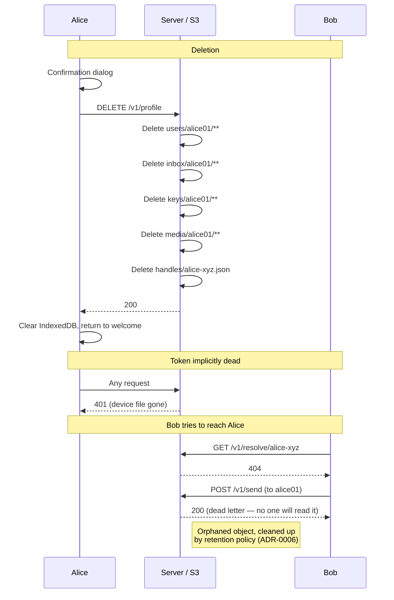

# Scenario: Account deletion

Alice decides to leave the service and deletes her account.
All her data is removed and her handle becomes unresolvable.

**Prerequisite**: [Profile and contacts](./profile-and-contacts.md) completed.

## Overview


Alice has a profile with display name, avatar, contacts, messages, and key backups.

## Cast

- **Alice** — deletes her account
- **Bob** — tries to reach Alice after deletion

## Starting S3 state

```
users/alice01/profile.json
users/alice01/contacts.json
users/alice01/devices/adev01.json
users/alice01/devices/adev02.json

handles/alice-xyz.json

inbox/alice01/live/msg001..msg009
inbox/alice01/archive/2026-02-15-{ULID}   ← compacted archive

keys/alice01/live/S1
keys/alice01/live/S2
keys/alice01/archive/2026-02-15-{ULID}

media/alice01/avatar/abc123.jpg
```

## 1. Alice confirms deletion (client-side)

Alice's client shows a confirmation dialog:

> "This will permanently delete your account, all messages, and all data.
> This cannot be undone."

Alice confirms. No server call yet — the confirmation is purely client-side.

## 2. Alice deletes her account

```
DELETE /v1/profile
→ 200
```

Server logic:
1. Reads `users/alice01/profile.json` to get `handle: "alice-xyz"`.
2. Lists and deletes all objects under `users/alice01/`.
3. Lists and deletes all objects under `inbox/alice01/`.
4. Lists and deletes all objects under `keys/alice01/`.
5. Lists and deletes all objects under `media/alice01/`.
6. Deletes `handles/alice-xyz.json`.

S3 state after: **all of the above are gone.**

The client clears IndexedDB, clears the device token, and returns to the
welcome screen.

## 3. Alice's token is implicitly invalidated

Alice's token is still cryptographically valid (HMAC-based, stateless), but
subsequent requests fail because:

- `requireAuth` calls `HeadObject` on `users/alice01/devices/adev01.json`
- The device file no longer exists → 401

No explicit token revocation needed.

## 4. Bob tries to resolve Alice's handle

```
GET /v1/resolve/alice-xyz
→ 404
```

Bob's client shows "User not found." The handle `alice-xyz` is now
available for future registrations (though collision is unlikely with random
two-word handles).

## 5. Bob sends a message to Alice's user ID

If Bob's client still has Alice's `user_id` cached:

```
POST /v1/send
{
  "envelopes": [
    { "to_user": "alice01", ..., "msg_id": "msg010", ... }
  ]
}
→ 200
```

The server writes `inbox/alice01/live/msg010`. This is a dead letter — no one
will ever read it. The next cleanup cycle (ADR-0006) will garbage-collect
orphaned inbox objects for users with no profile.

**Note**: the server does not validate that `to_user` has a profile. This is
by design — the server never inspects message content or routing beyond writing
to the inbox prefix.

## 6. Second delete returns 404

If Alice's other device (`adev02`) also tries to delete (race condition):

```
DELETE /v1/profile
→ 404
```

The profile is already gone. The handler is idempotent from the user's
perspective.

## S3 state after scenario

```
                                   ← all alice01 objects deleted
users/bob01/profile.json
users/bob01/contacts.json          ← still has Alice in encrypted contacts
users/bob01/devices/bdev01.json

handles/bob-abc.json
                                   ← handles/alice-xyz.json deleted

inbox/alice01/live/msg010          ← dead letter from step 5
inbox/bob01/live/msg002..msg009
```

## What to test

- `DELETE /v1/profile` returns 200 and removes all user objects.
- `GET /v1/resolve` returns 404 after deletion.
- Inbox, backups, media, and handle file are all gone.
- Second `DELETE /v1/profile` returns 404.
- Subsequent authenticated requests return 401 (device file gone).
- Client clears local state and returns to welcome screen.
