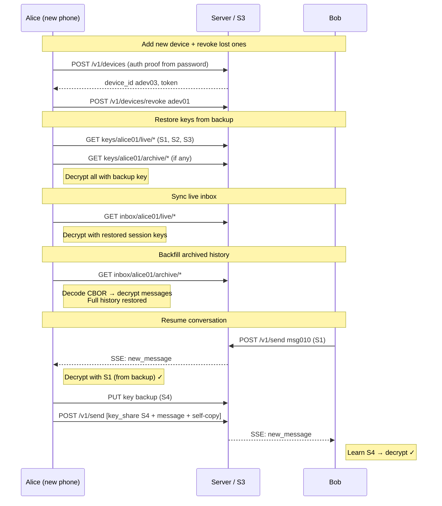

# Scenario: Account recovery

Alice loses all her devices. She recovers her account on a new phone
using only her password.

**Prerequisite**: [Multi-device](./multi-device.md) completed, then both
of Alice's devices are lost (laptop broken, phone stolen and revoked).
Some inbox messages have been compacted into archives.

## Overview



## Cast

- **Alice** — recovers her account on a new device
- **Bob** — already in conversation with Alice

## Starting S3 state

After multi-device scenario + some time passing. Compaction has archived
older messages. Alice's phone (`adev02`) was revoked (device file deleted).

```
users/alice01/profile.json
users/alice01/devices/adev01.json          ← laptop (lost, not revoked)
                                           ← adev02 deleted (revoked)
users/bob01/profile.json
users/bob01/devices/bdev01.json

handles/alice-xyz.json
handles/bob-abc.json

inbox/alice01/archive/2025-01-15-{ULID}    ← CBOR: msg001..msg004
inbox/alice01/live/msg006                  ← "Sent from my phone" (self-copy)
inbox/alice01/live/msg007                  ← "Got it!"

inbox/bob01/archive/2025-01-15-{ULID}      ← CBOR: msg002..msg004
inbox/bob01/live/msg005                    ← key share from Alice phone (S3)
inbox/bob01/live/msg006                    ← "Sent from my phone"
inbox/bob01/live/msg007                    ← "Got it!" (self-copy)

keys/alice01/live/S1
keys/alice01/live/S2
keys/alice01/live/S3
keys/bob01/live/S1
keys/bob01/live/S3
```

## 1. Alice adds a new device

Alice gets a new phone, opens the app, chooses "Recover account",
and enters her password.

The phone resolves her `salt`/`kdf`, runs Argon2id then HKDF, and derives the
same three keys (auth, sharing, backup) from the backup secret.
Generates a new device ID and signs an auth proof:

```
POST /v1/devices
{
  "user_id": "alice01",
  "auth_proof": {
    "payload": { "user_id": "alice01", "device_id": "adev03", "timestamp": "2025-01-20T09:00:00Z" },
    "signature": "<Ed25519 signature>"
  },
  "device_label": "Alice's new phone"
}
→ { "device_id": "adev03", "token": "tok_a3" }
```

Server verifies the signature against `auth_public_key` in `profile.json`.

S3 writes:
- `users/alice01/devices/adev03.json`

Phone stores in IndexedDB: sharing private key, backup encryption key, device token.
Backup secret is discarded from memory.

**Note**: Alice should also revoke the lost laptop (`adev01`) at this point:

```
POST /v1/devices/revoke
{
  "device_id": "adev01",
  "auth_proof": {
    "payload": { "user_id": "alice01", "device_id": "adev01", "timestamp": "2025-01-20T09:01:00Z" },
    "signature": "<Ed25519 signature>"
  }
}
```

S3 deletes:
- `users/alice01/devices/adev01.json`

## 2. Restore Megolm keys from backup

New device sync starts with key backups (needed before any messages can be decrypted):

```
GET /v1/store/list?prefix=keys/alice01/live/
→ ["keys/alice01/live/S1", "keys/alice01/live/S2", "keys/alice01/live/S3"]

GET /v1/store/object?key=keys/alice01/live/S1
GET /v1/store/object?key=keys/alice01/live/S2
GET /v1/store/object?key=keys/alice01/live/S3
```

Phone decrypts each with the backup encryption key → recovers Megolm session keys
S1, S2, and S3. Stores in IndexedDB.

If key backups had been compacted into archives:

```
GET /v1/store/list?prefix=keys/alice01/archive/
→ ["keys/alice01/archive/2025-01-15-{ULID}"]

GET /v1/store/object?key=keys/alice01/archive/2025-01-15-{ULID}
```

CBOR archive → decrypt each entry → recover any keys not already in live.

## 3. Sync live inbox

```
GET /v1/store/list?prefix=inbox/alice01/live/
→ ["inbox/alice01/live/msg006", "inbox/alice01/live/msg007"]

GET /v1/store/object?key=inbox/alice01/live/msg006
GET /v1/store/object?key=inbox/alice01/live/msg007
```

Processing:
1. `msg006` — `megolm.message` with S3: decrypts → "Sent from my phone" (self-copy).
2. `msg007` — `megolm.message` with S1: decrypts → "Got it!".

Phone now has the most recent messages.

## 4. Sync archived inbox (history backfill)

Phone walks backwards through archive prefixes:

```
GET /v1/store/list?prefix=inbox/alice01/archive/
→ ["inbox/alice01/archive/2025-01-15-{ULID}"]

GET /v1/store/object?key=inbox/alice01/archive/2025-01-15-{ULID}
```

CBOR archive contains msg001..msg004. Phone decodes each:

1. `msg001` — `megolm.key_share`: decrypts with sharing private key → S1 (already have it, idempotent).
2. `msg002` — `megolm.message` with S1: decrypts → "Hey Alice".
3. `msg004` — `megolm.message` with S2: decrypts → "Hey Bob" (self-copy).

Full history is restored. Older archives (if any) can be fetched lazily on scroll.

## 5. Bob sends a new message

Bob sends while Alice's new device is online:

```
POST /v1/send
{
  "envelopes": [
    {
      "to_user": "alice01", ...,
      "content_type": "megolm.message",
      "msg_id": "msg010",
      "payload": { "session_id": "S1", "ciphertext": "<Megolm(S1, 'Welcome back!')>" }
    },
    { "to_user": "bob01", ..., "msg_id": "msg010", ... }
  ]
}
```

Alice's new phone syncs:

```
GET /v1/store/list?prefix=inbox/alice01/live/&cursor=msg007
→ ["inbox/alice01/live/msg010"]

GET /v1/store/object?key=inbox/alice01/live/msg010
```

Decrypts with S1 → "Welcome back!". No new key share needed — Alice already
has S1 from the key backup.

## 6. Alice replies (new session)

Alice's new phone creates a fresh Megolm session `S4`:

**Key backup:**

```
POST /v1/store/presign
{ "key": "keys/alice01/live/S4", "bytes": 256 }
```

**Send:**

```
POST /v1/send
{
  "envelopes": [
    {
      "to_user": "bob01", ...,
      "from_device": "adev03",
      "content_type": "megolm.key_share",
      "msg_id": "msg011",
      "payload": {
        "ephemeral_key": "<base64 P-256 pub, uncompressed SEC1>",
        "iv": "<base64>",
        "ciphertext": "<base64 ECIES(bob_sharing_pub, S4 session key)>"
      }
    },
    {
      "to_user": "bob01", ...,
      "from_device": "adev03",
      "content_type": "megolm.message",
      "msg_id": "msg012",
      "payload": { "session_id": "S4", "ciphertext": "<Megolm(S4, 'New phone, same me')>" }
    },
    {
      "to_user": "alice01", ...,
      "from_device": "adev03",
      "content_type": "megolm.message",
      "msg_id": "msg012",
      "payload": { "session_id": "S4", "ciphertext": "<Megolm(S4, 'New phone, same me')>" }
    }
  ]
}
```

Bob processes key share → gets S4, decrypts → "New phone, same me".
Bob sees `from_device: "adev03"` — a new device, same Alice.

## S3 state after scenario

```
users/alice01/profile.json
users/alice01/devices/adev03.json          ← new (only device)
users/bob01/profile.json
users/bob01/devices/bdev01.json

handles/alice-xyz.json
handles/bob-abc.json

inbox/alice01/archive/2025-01-15-{ULID}    ← CBOR: msg001..msg004
inbox/alice01/live/msg006
inbox/alice01/live/msg007
inbox/alice01/live/msg010                  ← "Welcome back!"
inbox/alice01/live/msg012                  ← "New phone, same me" (self-copy)

inbox/bob01/archive/2025-01-15-{ULID}
inbox/bob01/live/msg005..msg007
inbox/bob01/live/msg010                    ← "Welcome back!" (self-copy)
inbox/bob01/live/msg011                    ← key share (S4)
inbox/bob01/live/msg012                    ← "New phone, same me"

keys/alice01/live/S1
keys/alice01/live/S2
keys/alice01/live/S3
keys/alice01/live/S4               ← new
keys/bob01/live/S1
keys/bob01/live/S3
keys/bob01/live/S4                 ← new
```

## What to test

- Account recovery works with only the password (no other device needed).
- Key backups are restored before inbox sync (keys needed to decrypt messages).
- Archived key backups (CBOR) are decoded and decrypted correctly.
- Archived inbox messages (CBOR) are decoded and decrypted correctly.
- Duplicate key restoration is idempotent (key share in archive + key backup).
- New device can send messages with a fresh session; Bob receives and decrypts.
- Lost devices are revokable from the new device.
- History backfill works in reverse date order (newest archives first).
