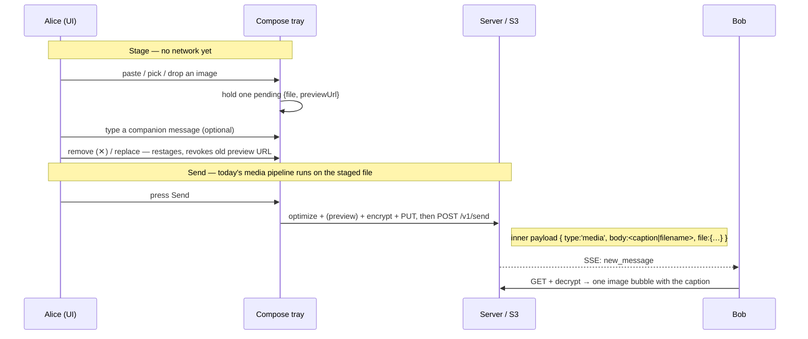

# Scenario: Compose tray — stage, caption, send

Alice attaches an image and sends it **with a message** in one bubble. Picking,
pasting, or dropping an image **stages** it next to the text box rather than
sending immediately; Alice types a companion message and presses **Send**, which
produces a single media message whose `body` is the typed text.

**Prerequisite**: [Media](./media.md) — the encrypt + upload + send pipeline this
flow drives at Send is unchanged. This scenario adds only the staging UI in front
of it (P1d, [ADR-0022](../decisions/adr-0022-multipart-media.md)).

## Overview



## Cast

- **Alice** — stages an image, adds a caption, sends.
- **Bob** — receives one image message carrying the caption.

## 1. Alice stages an attachment

Alice has three ways to stage, all landing in the same single-item tray:

- **Picker** — the 📎 control opens the file picker; choosing a file stages it
  (it is **not** sent).
- **Paste** — pasting an image from the clipboard (e.g. a screenshot) into the
  text box stages it; pasting text pastes through untouched.
- **Drag-drop** — dropping a file onto the compose area stages it.

The tray holds exactly **one** pending item. Attaching another **replaces** it
(the previous thumbnail's object URL is revoked). The tray shows:

- an **image** → a thumbnail (`compose-thumb`) from a local object URL;
- a **non-image** → a name + size chip (`compose-file`);

each with a remove control (`compose-remove`, ✕) that clears the staging.

No network request is made while staging — not even the 25 MB size check, which
runs at Send (an oversize staged file fails there, before any presign).

## 2. Alice adds a companion message and sends

With an image staged, the text box accepts an optional caption. **Send** is
enabled when there is text **or** a staged attachment (a caption-less image is a
valid send).

Pressing **Send** runs the existing media pipeline on the staged file
([Media](./media.md) §1–2): optimize + strip EXIF (default), generate a
conditional preview, encrypt, upload-then-send. The only new behaviour is the
message `body`:

```json
{
  "type": "media",
  "body": "sunset, night one",
  "file": { "url": "media/alice01/<ulid>", "key": "…", "iv": "…", "name": "beach.jpg", "size": 812345 }
}
```

`body` is the typed caption, trimmed; an empty caption falls back to the
filename (so a caption-less send is byte-for-byte what v0.1 produced). On
dispatch, both the draft text and the staged attachment are cleared.

With **no** staged attachment, Send behaves exactly as before — a plain
`type:'text'` message.

## 3. Bob receives one bubble

Bob syncs and decrypts as in [Media](./media.md) §3. The materializer renders
the media message with its `body` as the bubble text and the image inline — one
bubble carrying both the photo and Alice's caption.

## What to test

- Pasting an image **stages** it (tray visible) and does **not** send; typing a
  caption then Send round-trips one image whose bubble shows the caption.
- Picking via 📎 stages (tray visible, nothing sent yet); Send then delivers it.
- Removing (✕) clears the staged item.
- Send with only text (nothing staged) is unchanged (plain text message).
- Send with only an image (no caption) → `body` falls back to the filename.
- An oversize staged file is rejected at Send (no presign), matching the v0.1
  oversize behaviour now deferred to Send time.
