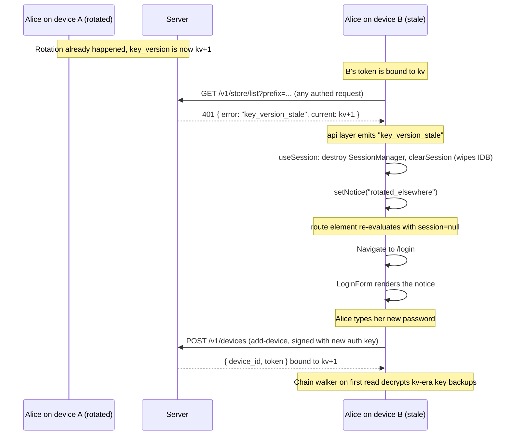

# Scenario: Multi-device cutoff after credential rotation

Alice rotated her password on device A
([credential-rotation](./credential-rotation.md)). Device B is still
signed in with a token bound to the previous `key_version`. The next
authenticated request from B trips the server's auth middleware,
the client wipes local state, and Alice lands on `/login` with a
one-line notice instead of a generic auth error. Matches
[`web/e2e/credential-multi-device-cutoff.spec.ts`](../../web/e2e/credential-multi-device-cutoff.spec.ts).
See [ADR-0012](../decisions/adr-0012-backup-secret-rotation.md) —
*Multi-device propagation*.

## Overview



## 1. The trigger: any authenticated request on B

Once A's rotation commits, every B-side request hits the server with a
token whose `key_version` no longer matches `profile.key_version`. The
middleware in
[`server/middleware.go`](../../server/middleware.go) (`requireAuth`)
returns `401 key_version_stale { current: kv+1 }`. Endpoints that
sit behind `requireAuth` (storage, send, profile, devices, rotate-keys
itself) all surface the same error code.

The first request to fail depends on what B is doing. A user idling on
the chat list will hit it via the inbox sync; a user opening Settings
will hit it via `useDevices`; a send attempt will hit it via
`POST /v1/send`. The cutoff is the same in every case.

## 2. The API layer emits a typed event

[`web/src/lib/api.ts`](../../web/src/lib/api.ts) classifies error
responses in a shared helper (`throwForErrorResponse`) used by both
the JSON `request()` path and the binary `storeGet()` path. On
`error === "key_version_stale"` it:

- Emits the `key_version_stale` event on the `authEvents`
  `EventTarget`.
- Throws `KeyVersionStaleError(current)` so callers that want to
  branch on the value (today: `useRotateKeys`, for the 401/409 fork)
  can do so.

The emit-then-throw order matters: subscribers run synchronously
during `dispatchEvent`, so by the time the throw propagates the
session wipe has already been scheduled.

## 3. `useSession` reacts

[`web/src/hooks/useSession.ts`](../../web/src/hooks/useSession.ts)
holds a subscription per auth-event type. `key_version_stale` is the
third subscriber, alongside `device_revoked` and `unauthorized`:

```ts
const handleKeyVersionStale = useCallback(async () => {
    setSessionManager((prev) => {
        prev?.destroy();
        return null;
    });
    setSession(null);
    await new Promise((r) => setTimeout(r, 0));
    await clearSession();
    setNotice('rotated_elsewhere');
}, []);
```

`clearSession` (not `clearToken`) is the right choice because the IDB
keys still on device B are encrypted under the kv-era backup key. The
server-side ciphertext written *after* the rotation is wrapped under
the new key, so B's IDB contents are useless until re-derived from
the new password. Wiping avoids stale-decrypt failures on the next
sign-in.

`destroy()`-before-`setSession(null)` mirrors the logout path: the
React effect cleanup that runs when `session` flips to null relies on
the SessionManager already being released, otherwise an in-flight IDB
transaction can block `deleteDatabase`.

## 4. The router redirects to `/login`

[`web/src/routes/app.tsx`](../../web/src/routes/app.tsx) wires every
authenticated route to `<Navigate to="/login" replace />` when
`session` is null. There is no programmatic navigation in the cutoff
handler — the redirect falls out of React's re-render when the
session flips. Whatever screen B was on (settings, a chat, the chat
list) gets unmounted; the `/login` route mounts with the notice prop
threaded through `app.tsx` → `LoginRoute` → `LoginForm`.

## 5. The notice

[`web/src/components/LoginForm.tsx`](../../web/src/components/LoginForm.tsx)
renders the notice line above the form when `notice === 'rotated_elsewhere'`:

> *This account was rotated on another device. Please sign in with your new password.*

Styling is `text-muted-foreground` — the same calm tone used for
secondary copy elsewhere, not a destructive alert. The notice is
identified in tests via `data-testid="login-notice"`. Typing in
either field dismisses the notice via `onDismissNotice`, so the
explanatory line doesn't linger once the user starts engaging with
the form.

A successful `handleLogin` also clears the notice, so the user
doesn't see it again if they ever sign out and come back later.

## 6. Recovery on B

Signing in with the new password follows the standard
[credential-registration](./credential-registration.md) login path
(autodetect → Argon2id → add-device → token at kv+1). The clean IDB
means the first restore of session keys triggers a full chain walk
from
[`web/src/lib/key-chain.ts`](../../web/src/lib/key-chain.ts) — kv-era
key backups are re-wrapped via the chain link Alice's device A
appended in step 4 of the rotation scenario, and pre-rotation history
decrypts on B without any extra UX.

## What is *not* in scope here

- **Multi-tab broadcasting**: if Alice has the PWA open in two tabs
  on device B and rotates from a third, both B tabs catch up on
  their own next API call. A `BroadcastChannel` would short-circuit
  this but isn't load-bearing — the cutoff lands eventually on every
  tab regardless. Adding it is a follow-up if real-device telemetry
  shows the lag is user-visible.
- **Active-tab nudge**: there is no push or SSE message telling B
  "you've been rotated out." The 401 is the signal. If B sits idle
  with no SSE traffic and no user action, it stays signed in
  visually until the next action; data it shows is read-only from
  IDB and was decrypted before the rotation, so it's not misleading.
- **Detecting account deletion**: covered by
  [stolen-device](./stolen-device.md) /
  [account-deletion](./account-deletion.md) via the
  `403 device_revoked` path. Different code, different remediation.

## S3 / server state

This scenario does not write any new S3 state. It is purely a
client-side reaction to server state that the rotation scenario has
already produced.
