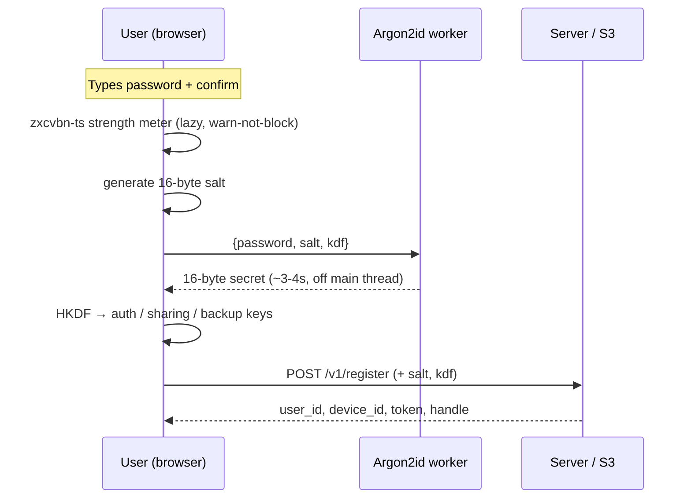

# Scenario: Credential registration (password)

A new user registers with a password instead of a BIP39 mnemonic. The
password is stretched through Argon2id into the 16-byte backup secret that
feeds the existing HKDF chain. Matches `web/e2e/credential-registration.spec.ts`.
See [ADR-0011](../decisions/adr-0011-credential-derivation.md).

## Overview



## 1. Enter password

The registration screen shows a password + confirm pair and a lazy-loaded
[zxcvbn-ts](https://github.com/zxcvbn-ts/zxcvbn) strength meter. The meter
**warns** on weak scores and surfaces a Have-I-Been-Pwned hit (k-anonymity,
best-effort) but never blocks submission. A single acknowledgement checkbox
("my password cannot be reset") gates the submit button alongside the
passwords-match check. There is **no** recovery-phrase UI on this screen.

## 2. Derive

On submit, the client generates a random 16-byte salt and posts
`{password, salt, kdf}` to the Argon2id Web Worker (`DEFAULT_KDF =
{ type: "argon2id", m: 65536, t: 3, p: 1 }`). The worker returns the 16-byte
secret after ~3-4s on a mid-tier device; a "Deriving your keys…" cover renders
meanwhile. The secret feeds the unchanged HKDF chain (auth Ed25519, sharing
ECDH P-256, backup AES-256-GCM).

## 3. Register

```
POST /v1/register
{
  "device_label": "Pixel 7",
  "auth_public_key": "<auth_pub>",
  "sharing_public_key": "<sharing_pub>",
  "salt": "<base64url, 16 bytes>",
  "kdf": { "type": "argon2id", "m": 65536, "t": 3, "p": 1 }
}
→ { "user_id": "...", "device_id": "...", "token": "...", "handle": "..." }
```

The server validates the KDF shape (`type == "argon2id"`, `m ∈ [8, 1048576]`
KiB, `t ∈ [1, 16]`, `p ∈ [1, 8]`, salt decodes to exactly 16 bytes). It rejects
a partial set (salt without kdf or vice versa) or malformed params with
`400 bad_request`. On success it persists `salt`, `kdf`, and `key_version: 1`
onto `profile.json` and the `handles/{handle}.json` projection.

A v1 (legacy mnemonic) registration omits `salt`/`kdf`; the server stores a
clean v1 profile with none of the three fields. That path is retained for the
migration-mechanism rehearsal but is no longer exposed in the production UI.

## 4. Login (autodetect)

A returning device enters its handle and credential into a single field. The
client autodetects: 12 valid wordlist tokens with a good checksum → legacy
direct-HKDF path; otherwise → fetch `salt` + `kdf` from
`GET /v1/resolve/{handle}`, run Argon2id, then HKDF. Both converge on the same
16-byte secret. See [multi-device](./multi-device.md) for the add-device flow.

## S3 state

- `users/{uid}/profile.json` — gains `salt`, `kdf`, `key_version: 1` (v2 only).
- `handles/{handle}.json` — projection gains the same three fields.
- Everything else (devices, inbox, keys) is unchanged from
  [first-conversation](./first-conversation.md).
