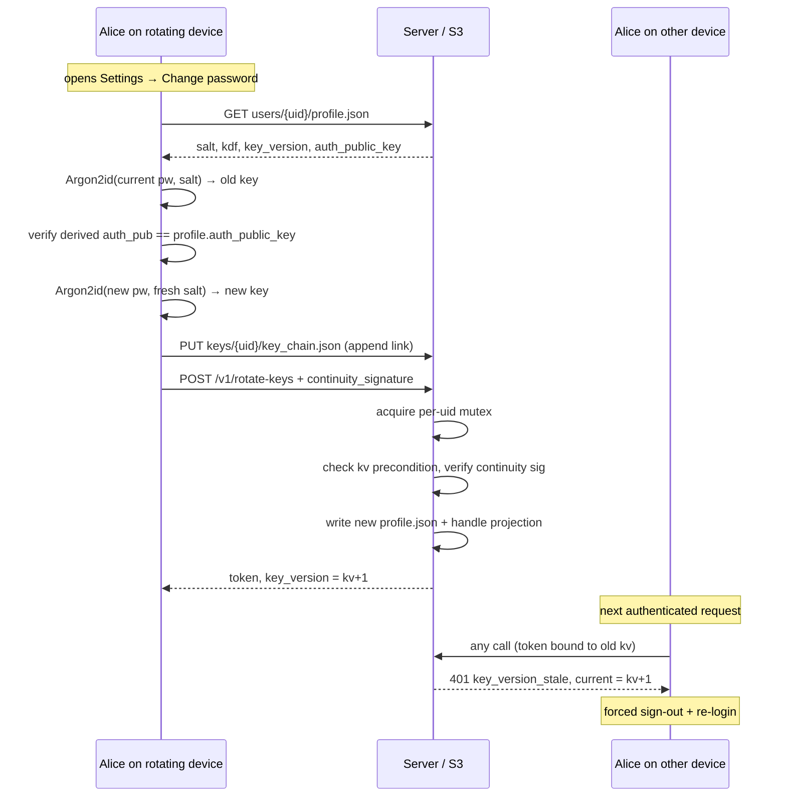

# Scenario: Credential rotation (change password)

Alice changes her password from Settings. The rotating device replaces
the auth, sharing, and backup keys atomically; every other device gets
signed out; pre-rotation key backups stay readable via the chain.
Matches `web/e2e/credential-rotate-ui.spec.ts`. See
[ADR-0012](../decisions/adr-0012-backup-secret-rotation.md).

## Overview



## 1. Read the current state

The rotating client fetches its own `profile.json` for the
`auth_public_key`, `salt`, `kdf`, and `key_version`. One read covers
all four — the data is under the caller's own prefix.

## 2. Verify the current password

Argon2id over `(currentPassword, profile.salt, profile.kdf)` produces
a 16-byte secret; `deriveKeys(secret, { extractable: true })` derives
auth/sharing/backup. If the derived `auth_public_key` doesn't match
the published one, the entered current password is wrong and the flow
aborts before any server call. `extractable: true` is the
rotation-only escape hatch from [ADR-0011](../decisions/adr-0011-credential-derivation.md):
the old backup key is briefly exportable so it can be wrapped into a
chain link, then dropped.

## 3. Derive new keys

Fresh 16-byte salt → `Argon2id(newPassword, newSalt, DEFAULT_KDF)` →
new auth/sharing/backup keys. The new salt and KDF params travel with
the rotation request.

## 4. Write the chain link

```
buildChainLink(currentKV, currentKV+1, oldBackupKey, newBackupKey)
  → { from, to, iv, ciphertext = AES-256-GCM(newBackupKey, raw(oldBackupKey)) }
```

The client appends this link to `keys/{uid}/key_chain.json` **before**
calling rotate-keys. An orphaned link (if the next step fails) is
harmless — it can't decrypt anything until a future rotation matches it.

## 5. Rotate

```
POST /v1/rotate-keys
{
  "request_id":          "<UUID v4>",
  "key_version":         2,
  "auth_public_key":     "<new>",
  "sharing_public_key":  "<new>",
  "salt":                "<new>",
  "kdf":                 { "type": "argon2id", ... },
  "continuity_signature": "<Ed25519 over JCS of the above, by OLD auth key>"
}
→ { "token": "...", "key_version": 2 }
```

The server's per-uid mutex serializes the GET-VERIFY-WRITE on
`profile.json`; the `key_version` precondition (`req.kv ==
current.kv+1`) closes the race window the mutex doesn't quite cover.
The continuity signature is verified against the **current**
`profile.auth_public_key`, which is the cryptographic anchor that
makes "I know the old password" a precondition.

## 6. Swap session and discard transient material

The rotating device receives a new token at the new key_version, and
the in-memory session is updated. The new backup key is **re-derived
non-extractable** for IDB persistence — the extractable copy used in
step 4 goes out of scope and is GC'd. The old backup key was never
persisted as extractable.

## 7. Other devices

Other devices keep working until their next authenticated request,
which returns `401 key_version_stale { current: kv+1 }`. They wipe
local state, route to `/login`, and the user re-enters the new
password. See
[credential-multi-device-cutoff](./credential-multi-device-cutoff.md)
for the client-side flow.

## S3 state after rotation

- `users/{uid}/profile.json` — new `auth_public_key`,
  `sharing_public_key`, `salt`, `kdf`, `key_version`.
- `handles/{handle}.json` — projection updated to match.
- `keys/{uid}/key_chain.json` — gains one link.
- `users/{uid}/rotation-records/{request_id}.json` — idempotency
  record, 24 h TTL.
- All `keys/{uid}/live/*` and `users/{uid}/contacts.json` blobs still
  reference their original `v` — lazy migration only.
