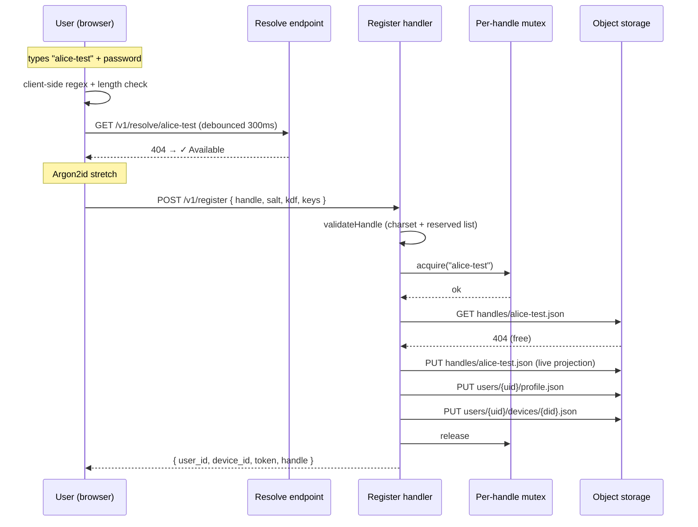

# Scenario: User-chosen handle at registration

Users type the handle they want at registration, get real-time
availability feedback, and own a memorable identifier. The server
enforces uniqueness atomically via a per-handle in-process mutex and
reserves deleted handles for 30 days. Matches
`web/e2e/custom-handles.spec.ts`. See
[ADR-0013](../decisions/adr-0013-user-chosen-handles.md).

## Overview



## 1. Pick a handle

The registration form opens with the handle field above the password
fields. A leading `@` is rendered as a CSS affordance; the input value
itself is the bare handle. A **Surprise me** button generates a
random `word1-word2` pair from the client-side BIP39 wordlist
(`@scure/bip39`, bundled for this suggester — no new dependency
weight).

As the user types, the form runs two checks in parallel:

1. **Client-side shape check** (`web/src/lib/handle-suggest.ts:validateHandleShape`):
   regex `^[a-z][a-z0-9-]{1,30}[a-z0-9]$` and a forbid-double-hyphen
   rule. Failures render inline (`Handle must be 3–32 lowercase
   letters…`) with no server round-trip.
2. **Server-side availability**: `GET /v1/resolve/{handle}`, debounced
   300 ms. Three response codes branch the indicator:
   - 200 → ✗ Taken.
   - 404 → ✓ Available.
   - 410 → ✗ In cooldown until *YYYY-MM-DD*.

The Register button stays disabled until shape is valid, availability
is ✓ Available, the password fields match, and the acknowledgement
checkbox is checked.

## 2. Atomic claim on the server

`POST /v1/register` carries `{ handle, device_label, auth_public_key,
sharing_public_key, salt, kdf }`. The handler in
[`server/handlers.go`](../../server/handlers.go) runs:

1. `validateHandle(req.Handle)` — same regex as the client plus the
   embedded reserved list (`server/reserved_handles.txt`). Charset
   violation → `400 handle_invalid`; reserved match → `400 handle_reserved`.
2. `handleMu.acquire(req.Handle, 500ms)` — the per-handle in-process
   mutex from [`server/handle_mutex.go`](../../server/handle_mutex.go).
   Timeout → `503 registration_unavailable`.
3. `GetObject(handles/{handle}.json)` — three branches:
   - `404` → free, proceed.
   - `200` live projection → `409 handle_taken`.
   - `200` tombstone with `released_at` in the future → `409 handle_in_cooldown`
     (body: `{ released_at, available_at }`).
   - `200` tombstone with `released_at + 30d` in the past → delete the
     stale tombstone in-band, proceed.
4. Generate `user_id` (ULID), `device_id` (ULID), `token` (v2 HMAC).
5. Write `handles/{handle}.json` (live projection) **first** — this
   claims the name under the mutex. Then write
   `users/{uid}/profile.json` and the device file. If either later
   write fails, best-effort `DeleteObject(handles/{handle}.json)` so
   the handle returns to the free pool.
6. Release the mutex; return `{ user_id, device_id, token, handle }`.

The GET-then-PUT inside the mutex makes the claim effectively atomic
on this instance. The mutex pattern is the same one ADR-0012 uses for
rotation; both will move to shared coordination if/when the server
ever scales horizontally.

## 3. URL routing

PWA routes for users live under `/@{handle}` —
`app.atmin.net/@alice-test`. System routes (`/login`, `/register`,
`/settings`, `/saved`) stay where they are. The `@` is **URL-only**:
- `GET /v1/resolve/{handle}` carries the bare handle.
- `handles/{handle}.json` keys the bare handle.
- `Profile.handle` stores the bare handle.

This avoids namespace drift between routes and handle policy as the
PWA grows (new system routes don't need to be added to the reserved
list).

## 4. Deletion → tombstone

`DELETE /v1/profile` removes all per-user data, then rewrites
`handles/{handle}.json` as a tombstone:

```jsonc
{ "released_at": "2026-06-25T10:30:00Z" }
```

`GET /v1/resolve/{handle}` returns `410 Gone` with
`{ released_at, available_at }` until `released_at + 30 days`. The
cooldown is symmetric — the prior owner does **not** get a
preferential re-claim — and addresses the impersonation risk an
immediate-takeover model would carry.

After the cooldown elapses, the cleanup routine sweeps the
tombstone (see
[server-cleanup-routine](../../tasks/server-cleanup-routine.md)).
Registrations that arrive between expiry and cleanup catch the stale
tombstone in step 2.4 above and delete it in-band — the 30-day
boundary is enforced at the millisecond, not at the cleanup cadence.

## 5. Login normalisation

The login form lowercases the handle input in real time and trims
whitespace before calling `resolve`. A user typing `Alice-Test`
sees `alice-test` in the field and submits successfully; without
this, they'd hit a misleading `404 not_found` because the storage
layer keys the canonical lowercase form.

`useLogin` also branches on the resolve result: `not_found` surfaces
*"No account with that handle"*; `released` surfaces *"That account
was deleted on YYYY-MM-DD"*; neither proceeds with the add-device
call.

## S3 state after a fresh registration

- `handles/{handle}.json` — live projection
  (`user_id`, `sharing_public_key`, `salt`, `kdf`, `key_version: 1`).
- `users/{uid}/profile.json` — full profile.
- `users/{uid}/devices/{device_id}.json` — first device.

After deletion, only `handles/{handle}.json` survives, with the
tombstone shape (`{ released_at }`) until the cleanup routine sweeps
it.
