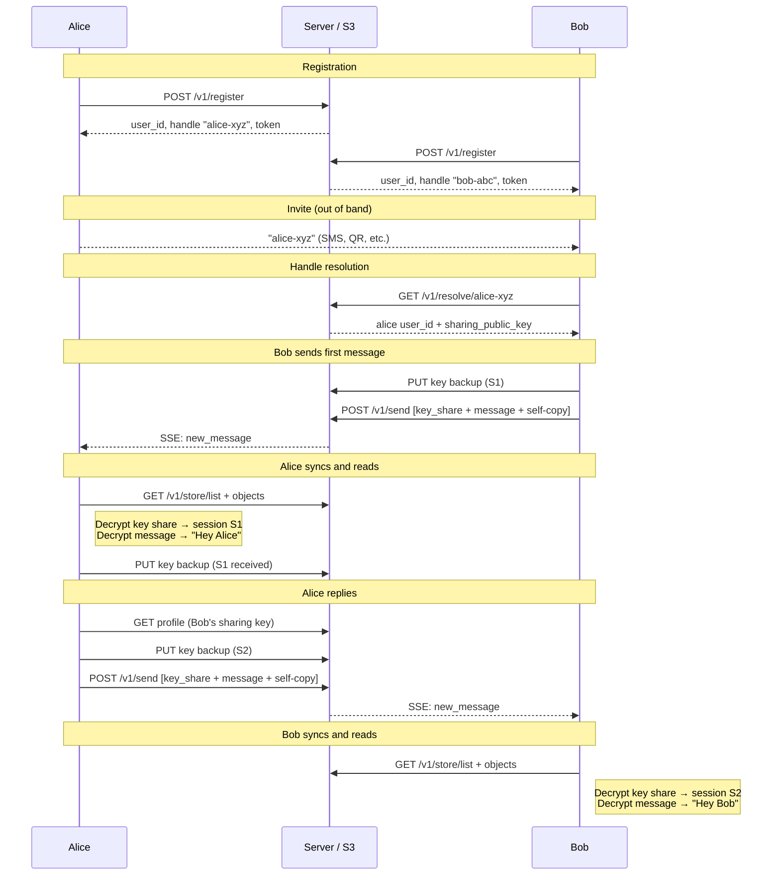

# Scenario: First conversation

Two users register, exchange an invite, establish E2E, and send messages.

## Overview



## Cast

- **Alice** — registers first, shares her handle
- **Bob** — resolves Alice's handle, initiates conversation

## 1. Alice registers

Client generates a 128-bit backup secret (displayed as a 12-word BIP39 mnemonic),
derives three keys via HKDF-SHA256 (auth Ed25519, sharing ECDH P-256, backup AES-256-GCM),
displays the mnemonic for Alice to save in her password manager.

```
POST /v1/register
{
  "device_label": "Alice's laptop",
  "auth_public_key": "<alice_auth_pub>",
  "sharing_public_key": "<alice_sharing_pub>"
}
→ { "user_id": "alice01", "device_id": "adev01", "token": "tok_a1", "handle": "alice-xyz" }
```

S3 writes:
- `users/alice01/profile.json` — `{ user_id, handle, auth_public_key, sharing_public_key, created_at }`
- `users/alice01/devices/adev01.json` — `{ device_label: "Alice's laptop" }`
- `handles/alice-xyz.json` — `{ user_id, sharing_public_key }`

Client stores in IndexedDB:
- sharing private key (for decrypting key shares)
- backup encryption key (for key backup writes)
- device token

Backup secret is discarded from memory.

## 2. Bob registers

Same flow. Bob gets `user_id: "bob01"`, `handle: "bob-abc"`.

S3 writes:
- `users/bob01/profile.json`
- `users/bob01/devices/bdev01.json`
- `handles/bob-abc.json`

## 3. Alice shares her invite (out of band)

Alice sends `"alice-xyz"` to Bob via any channel (SMS, email, QR code, etc.).

No API calls. No S3 writes.

## 4. Bob resolves Alice's handle

```
GET /v1/resolve/alice-xyz
→ { "user_id": "alice01", "sharing_public_key": "<alice_sharing_pub>" }
```

S3 reads:
- `handles/alice-xyz.json` — contains both `user_id` and `sharing_public_key` (single read)

Bob's client now knows Alice's user ID and sharing public key.

## 5. Bob sends first message ("Hey Alice")

Bob's client creates a new Megolm session (session `S1`) for sending.

**Key backup** — Bob writes his session key to his own backup:

```
POST /v1/store/presign
{ "key": "keys/bob01/live/S1", "bytes": 256 }
→ { "presigned_url": "..." }

PUT <presigned_url>
← {"iv": "<base64>", "ciphertext": "<base64 AES-256-GCM of S1 session key>"}
```

**Send** — three envelopes in one call:

```
POST /v1/send
{
  "envelopes": [
    {
      "v": 1,
      "to_user": "alice01",
      "from_user": "bob01", "from_device": "bdev01",
      "msg_id": "msg001",
      "sent_at": "...",
      "content_type": "megolm.key_share",
      "payload": {
        "ephemeral_key": "<base64 P-256 pub, uncompressed SEC1>",
        "iv": "<base64 12-byte IV>",
        "ciphertext": "<base64 ECIES(alice_sharing_pub, S1 session key)>"
      }
    },
    {
      "v": 1,
      "to_user": "alice01",
      "from_user": "bob01", "from_device": "bdev01",
      "msg_id": "msg002",
      "sent_at": "...",
      "content_type": "megolm.message",
      "payload": {
        "session_id": "S1",
        "ciphertext": "<base64 Megolm(S1, {type: 'text', body: 'Hey Alice'})>"
      }
    },
    {
      "v": 1,
      "to_user": "bob01",
      "from_user": "bob01", "from_device": "bdev01",
      "msg_id": "msg002",
      "sent_at": "...",
      "content_type": "megolm.message",
      "payload": {
        "session_id": "S1",
        "ciphertext": "<base64 Megolm(S1, {type: 'text', body: 'Hey Alice'})>"
      }
    }
  ]
}
```

S3 writes:
- `inbox/alice01/live/msg001` — key share
- `inbox/alice01/live/msg002` — message
- `inbox/bob01/live/msg002` — self-copy
- `keys/bob01/live/S1` — key backup

Note: ULID ordering of `msg001` < `msg002` ensures Alice processes the key share before the message.

Note: Bob does not send himself the key share — he already has his own session key.

## 6. Alice syncs and reads the message

Alice's client has an open SSE connection (`GET /v1/events`). When Bob's
message is written, the server sends a `new_message` event. Alice's client
responds by syncing:

```
GET /v1/store/list?prefix=inbox/alice01/live/&cursor=...
→ ["inbox/alice01/live/msg001", "inbox/alice01/live/msg002"]

GET /v1/store/object?key=inbox/alice01/live/msg001
GET /v1/store/object?key=inbox/alice01/live/msg002
```

Processing:
1. `msg001` has `content_type: megolm.key_share` — Alice does ECDH (ephemeral_key × sharing_private), derives AES key via HKDF, decrypts to get Megolm session key `S1`. Stores in IndexedDB.
2. Alice writes the received key to her own backup:
   ```
   POST /v1/store/presign
   { "key": "keys/alice01/live/S1", "bytes": 256 }
   ```
3. `msg002` has `content_type: megolm.message` — Alice decrypts with session `S1`, reads "Hey Alice".
4. Alice persists cursor and msg_id de-dup set.

## 7. Alice replies ("Hey Bob")

Alice's client creates her own Megolm session (`S2`) for sending.

**Key backup:**

```
POST /v1/store/presign
{ "key": "keys/alice01/live/S2", "bytes": 256 }
```

Alice resolves Bob's sharing public key (she may have cached it from the envelope metadata,
or she fetches Bob's profile):

```
GET /v1/store/object?key=users/bob01/profile.json
```

**Send:**

```
POST /v1/send
{
  "envelopes": [
    {
      "to_user": "bob01", ...,
      "content_type": "megolm.key_share",
      "msg_id": "msg003",
      "payload": {
        "ephemeral_key": "<base64 P-256 pub, uncompressed SEC1>",
        "iv": "<base64>",
        "ciphertext": "<base64 ECIES(bob_sharing_pub, S2 session key)>"
      }
    },
    {
      "to_user": "bob01", ...,
      "content_type": "megolm.message",
      "msg_id": "msg004",
      "payload": {
        "session_id": "S2",
        "ciphertext": "<base64 Megolm(S2, {type: 'text', body: 'Hey Bob'})>"
      }
    },
    {
      "to_user": "alice01", ...,
      "content_type": "megolm.message",
      "msg_id": "msg004",
      "payload": {
        "session_id": "S2",
        "ciphertext": "<base64 Megolm(S2, {type: 'text', body: 'Hey Bob'})>"
      }
    }
  ]
}
```

S3 writes:
- `inbox/bob01/live/msg003` — key share
- `inbox/bob01/live/msg004` — message
- `inbox/alice01/live/msg004` — self-copy
- `keys/alice01/live/S2` — key backup

## 8. Bob syncs and reads the reply

Bob's SSE connection receives `new_message`. Same sync pattern as step 6:
Bob processes key share `msg003` first, stores Alice's session key `S2`,
then decrypts `msg004`.

## S3 state after scenario

```
users/alice01/profile.json
users/alice01/devices/adev01.json
users/bob01/profile.json
users/bob01/devices/bdev01.json

handles/alice-xyz.json
handles/bob-abc.json

inbox/alice01/live/msg001   ← key share from Bob
inbox/alice01/live/msg002   ← "Hey Alice"
inbox/alice01/live/msg004   ← "Hey Bob" (self-copy)

inbox/bob01/live/msg002     ← "Hey Alice" (self-copy)
inbox/bob01/live/msg003     ← key share from Alice
inbox/bob01/live/msg004     ← "Hey Bob"

keys/alice01/live/S1           ← Bob's session key (received)
keys/alice01/live/S2           ← Alice's own session key
keys/bob01/live/S1             ← Bob's own session key
```

## What to test

- Both clients can decrypt each other's messages after sync.
- Browser refresh: messages still decryptable from IndexedDB keys.
- Key shares arrive before messages (ULID ordering).
- Self-copies appear in sender's inbox.
- Key backups are written for both own and received session keys.
- Opening a chat lands at the newest message (no manual scroll required),
  and a chat that already fits in the viewport never surfaces the
  "jump to latest" indicator. A long chat (≥20 messages) re-opened from
  the chats list still opens scrolled to the bottom — the oldest message
  must be out of view.
