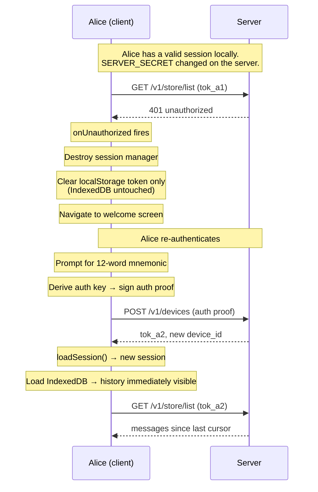
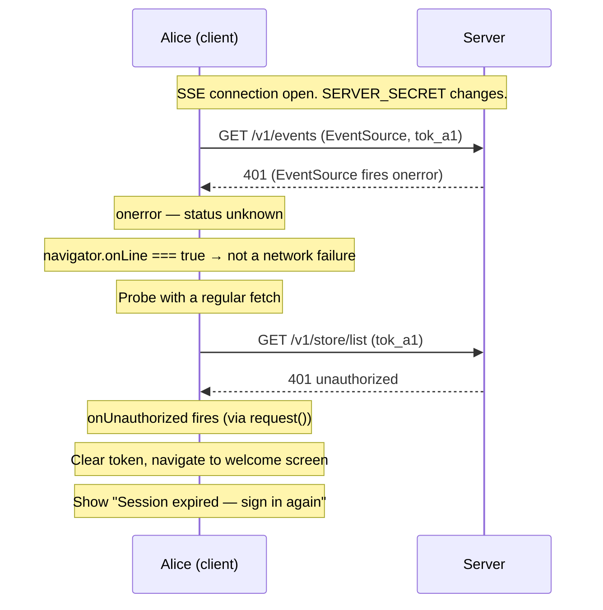

# Scenario: Invalid token (401)

Alice's token is rejected by the server. Her local message history survives
and she can re-authenticate to regain access.

## Overview — fetch path

## Overview — SSE path

The SSE path is more insidious. `EventSource` does not expose the HTTP status
code in `onerror` — a 401 and a network failure are indistinguishable from the
event alone. Without explicit handling, a secret rotation on the server causes
the SSE connection to silently fail, new messages stop arriving, and the app
shows an offline indicator. On mobile, where there is no console, the user has
no way to know their session has been invalidated.

## Cast

- **Alice** — registered device with messages in IndexedDB, token becomes invalid

## Background

Tokens do not expire. The token format is
`base64url(userID.deviceID.HMAC-SHA256(SERVER_SECRET, userID.deviceID))` —
there is no timestamp or TTL. A token is valid indefinitely unless
`SERVER_SECRET` changes on the server, which should never happen in normal
operation.

The server returns `401 unauthorized` only when the HMAC signature does not
verify. The client treats this the same regardless of why the server rejected
the token.

This is distinct from `403 device_revoked`, which means the device file was
explicitly deleted and triggers a full local wipe including IndexedDB (see
[Stolen device](./stolen-device.md)).

## What triggers a 401

Any authenticated API call can return 401:
- `GET /v1/store/list` (sync on load or SSE notification)
- `POST /v1/send` (sending a message)
- `GET /v1/events` (SSE connection — but see below)
- Any other request with an `Authorization` header or `token` query parameter

### SSE 401 detection

`EventSource` fires `onerror` for both network failures and server-side
rejections (4xx, 5xx). The status code is not accessible from the event.
When `onerror` fires:

- If `navigator.onLine === false`: treat as a network failure, defer to the
  offline-mode handling (see [Offline mode](./offline-mode.md)).
- If `navigator.onLine === true`: the server is reachable but rejected the
  connection. Issue a probe — a regular `fetch` to any authenticated endpoint
  (e.g. `GET /v1/store/list`). The probe goes through `request()`, which
  already calls `onUnauthorized()` on a 401. No special casing needed; the
  probe result triggers the same handler as any other 401.

## Client behaviour on 401

1. `api.ts` detects `status === 401` and calls `onUnauthorized()`.
2. `useSession` registers a dedicated `handleUnauthorized` as the
   `onUnauthorized` callback — separate from `handleLogout`, because the two
   differ in what they clean up.
3. `handleUnauthorized`:
   - Destroys the session manager (same as logout).
   - Does **not** call `deleteDevice` — the token is already invalid; the
     request would fail anyway.
   - Sets `session` to `null` so downstream components unmount.
   - Yields to let React flush unmounts and close IndexedDB connections.
   - Clears only the localStorage keys (`atmin:token`, `atmin:userId`, etc.)
     — does **not** call `deleteDatabase()`.
4. The UI returns to the welcome screen.

## After re-authenticating

Alice enters her 12-word mnemonic. The client derives the auth key, signs an
auth proof, and calls `POST /v1/devices` — the same flow used to add a second
device or recover an account. The server issues a fresh token for the same
user ID.

**Why the mnemonic is required**: the auth private key (Ed25519) is derived
from the mnemonic at registration and then discarded — it is never written to
IndexedDB. The keys that do survive (`sharingPrivateKey`, `backupKey`) are the
wrong type to sign an auth proof. This is intentional: a compromised device
cannot register new devices without the mnemonic. The consequence is that a
server-side secret rotation — however rare — forces the user to produce their
12 words to regain access.

On next load:

1. `loadSession()` reads the new token from localStorage and the existing
   crypto keys from IndexedDB. Session is valid immediately.
2. `useChat` loads messages from IndexedDB before the server sync completes.
   Alice sees her full history with no loading gap.
3. Server sync runs with the new token. Any messages received while offline
   are merged in.

Alice's Megolm sessions (inbound and outbound) are intact in IndexedDB. She
can still decrypt previously received messages and resumes her outbound
ratchet from the correct index.

## S3 state

No S3 state changes. The old device file (`users/alice01/devices/adev01.json`)
remains. After re-authentication a new device file is written
(`users/alice01/devices/adev02.json`). Alice may choose to revoke the old
entry via `POST /v1/devices/revoke`.

## What to test

- Any fetch-based API call returning 401 triggers `onUnauthorized`.
- SSE `onerror` while `navigator.onLine === true` issues a probe and triggers
  `onUnauthorized` if the probe returns 401.
- SSE `onerror` while `navigator.onLine === false` does not probe (deferred
  to offline-mode handling).
- `onUnauthorized` does not call `deleteDevice` (no outgoing request).
- localStorage keys are removed; IndexedDB is not cleared.
- UI navigates to the welcome screen, not the offline indicator.
- After re-authenticating with the mnemonic, the chat view shows messages
  from before the 401 immediately (IndexedDB load, before server sync).
- Megolm inbound and outbound sessions are intact after re-authenticating.
- `403 device_revoked` still triggers a full wipe (existing behaviour
  unchanged).
