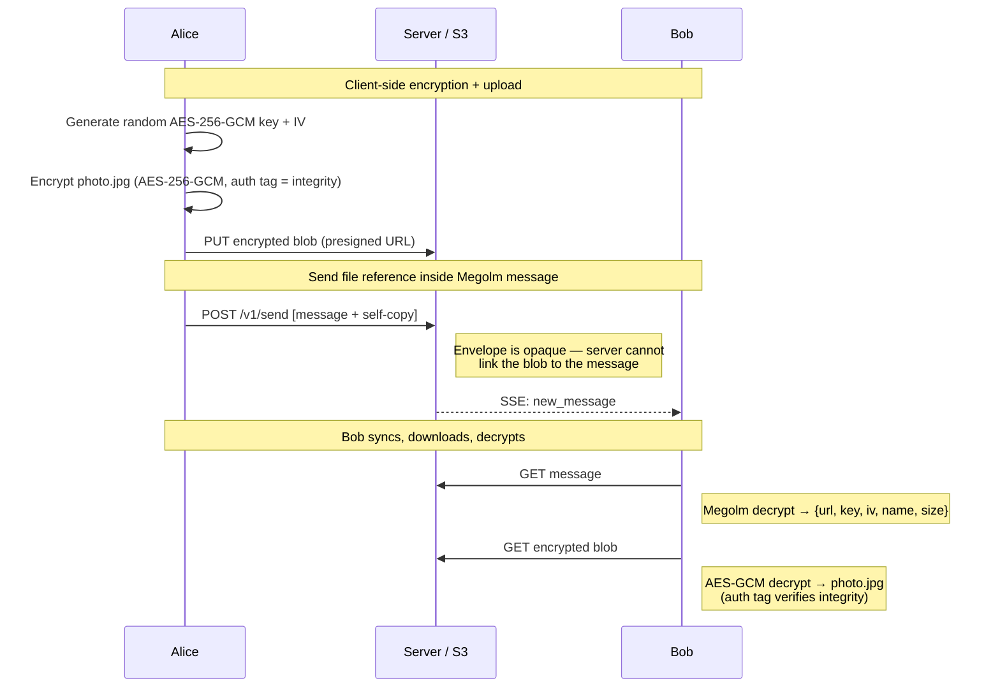

# Scenario: Media

Alice sends a photo to Bob. The file is encrypted client-side before upload.

**Prerequisite**: [First conversation](./first-conversation.md) completed.

## Overview


Alice (session S2) and Bob (session S1) can already exchange messages.

## Cast

- **Alice** — sends a photo
- **Bob** — receives and downloads it

## 1. Alice encrypts and uploads the file

Alice selects `photo.jpg` (48KB). Her client:

1. Generates a random AES-256-GCM key and 12-byte IV.
2. Checks `file.size` against the 25 MB per-blob cap (aborts with a
   client-side error if oversize — no network request).
3. Encrypts the file: `encrypted_blob = AES-256-GCM(key, iv, photo.jpg)`.
   The GCM auth tag is the sole integrity check at the recipient.
4. Requests a presigned PUT URL:

```
POST /v1/store/presign
{ "key": "media/alice01/<ulid>", "bytes": 48080 }
→ { "presigned_url": "..." }
```

The server validates `bytes ≤ 25 MB` (else `413 too_large`) and
`cached_usage + bytes ≤ quota` (else `413 quota_exceeded`), then returns
a presigned PUT URL signed with `Content-Length: 48080` (unsigned
`Content-Type: application/octet-stream`).

5. Uploads the encrypted blob:

```
PUT <presigned_url>
← <encrypted_blob bytes>
```

S3 writes:
- `media/alice01/<ulid>` — encrypted file (opaque to server)

The per-file key never leaves Alice's device unencrypted — it travels
inside the Megolm-encrypted message payload.

## 2. Alice sends the message

Alice sends the file reference inside her Megolm session S2.
The file key, IV, URL, and hash are all inside the encrypted payload.

```
POST /v1/send
{
  "envelopes": [
    {
      "v": 1,
      "to_user": "bob01",
      "from_user": "alice01", "from_device": "adev01",
      "msg_id": "msg008",
      "sent_at": "...",
      "content_type": "megolm.message",
      "payload": {
        "session_id": "S2",
        "ciphertext": "<base64 Megolm(S2, inner_plaintext)>"
      }
    },
    {
      "v": 1,
      "to_user": "alice01",
      "from_user": "alice01", "from_device": "adev01",
      "msg_id": "msg008",
      "sent_at": "...",
      "content_type": "megolm.message",
      "payload": {
        "session_id": "S2",
        "ciphertext": "<base64 Megolm(S2, inner_plaintext)>"
      }
    }
  ]
}
```

Where `inner_plaintext` (what Megolm encrypts) is:

```json
{
  "type": "media",
  "body": "photo.jpg",
  "file": {
    "url": "media/alice01/<ulid>",
    "key": "<base64 AES-256-GCM key>",
    "iv": "<base64 12-byte IV>",
    "name": "photo.jpg",
    "size": 48080
  }
}
```

S3 writes:
- `inbox/bob01/live/msg008` — message
- `inbox/alice01/live/msg008` — self-copy

No new key share — Bob already has S2 from the first conversation.

## 3. Bob syncs and downloads

```
GET /v1/store/list?prefix=inbox/bob01/live/&cursor=msg004
→ ["inbox/bob01/live/msg008"]

GET /v1/store/object?key=inbox/bob01/live/msg008
```

Bob decrypts with Megolm session S2 → gets the inner plaintext with file reference.

Bob's client downloads and decrypts the file:

```
GET /v1/store/object?key=media/alice01/<ulid>
```

1. Decrypts with the AES-256-GCM key and IV from the message payload.
   The GCM auth tag failing is the single terminal `corrupt` signal.
2. Sniffs magic bytes of the plaintext; PNG → renders as ``.

## S3 state (new objects only)

```
media/alice01/<ulid>    ← encrypted file

inbox/bob01/live/msg008             ← message with file reference
inbox/alice01/live/msg008           ← self-copy
```

## Security properties

- **Server sees**: an opaque encrypted blob at a ULID path and an opaque envelope. It cannot associate the blob with the message (the URL is inside the Megolm ciphertext).
- **Per-file key**: each file gets its own random AES-256-GCM key. Compromising one file key does not affect others.
- **Integrity**: AES-256-GCM's auth tag is the sole integrity check — any bit flip in key, IV, or ciphertext yields a decryption failure and a terminal `corrupt` state.
- **ULID path (not content-addressed)**: each upload occupies a fresh key. Re-uploading the same plaintext produces a new path and new ciphertext — no collision or overwrite risk, at the cost of no deduplication.
- **Inline render safety**: only PNG/JPEG/GIF/WebP (sniffed from plaintext magic bytes) render via ``. All other types are download-only. Blob URLs are never used as iframe or embed sources; navigation (click-through, download link) is allowed since the browser decodes the bytes in a fresh context, outside the app origin.

## What to test

- Encrypted upload via presigned URL succeeds.
- PUT with a body larger than the signed `Content-Length` is rejected by S3.
- Bob decrypts the file using key/IV from the message payload.
- Wrong file key → AES-GCM auth tag fails → terminal `corrupt` state; message bubble still renders.
- Tampering with the stored ciphertext (overwrite with random bytes) also yields `corrupt` on recipient when the blob is fetched in a fresh browser context that bypasses the immutable cache.
- A PNG fixture renders inline as `` with `data-testid="media-image"`; a non-image binary renders as `<a download>` with `data-testid="media-download"`.
- Refresh of recipient page re-renders inline image without a second `GET /v1/store/object` (browser HTTP cache via `Cache-Control: private, immutable, max-age=31536000`).
- Oversize attachment (>25 MB) is rejected client-side before any network request.
- PUT succeeds but `/v1/send` fails once, then retries with same `msg_id` → recipient sees exactly one message.
- Server cannot correlate blob path with envelope (URL only visible inside Megolm ciphertext).
