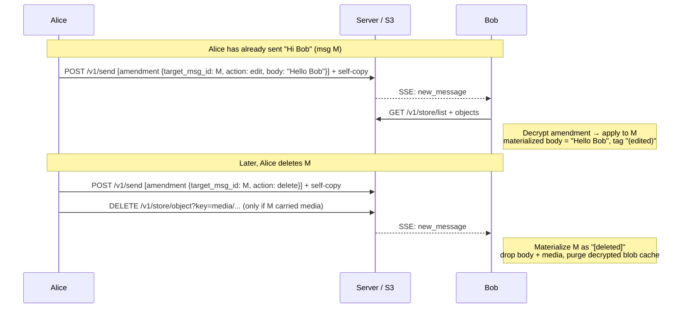

# Scenario: Message edits and deletes

A sender amends a message they already sent — fixing a typo (edit) or
retracting it (delete). Both are expressed as an *amendment* envelope that
references the original by `msg_id`; recipients re-present the original
accordingly. See [ADR-0014](../decisions/adr-0014-message-amendments.md).

## Overview



## Cast

- **Alice** — the sender; edits and then deletes her own message.
- **Bob** — the recipient; sees the edited body, the `(edited)` tag, and
  finally the `[deleted]` placeholder.

## 1. The amendment envelope

An amendment is a regular `megolm.message` envelope — no new content type. Its
decrypted inner plaintext is:

```json
{ "type": "amendment", "target_msg_id": "<M>", "action": "edit", "body": "Hello Bob" }
```

or, for a delete:

```json
{ "type": "amendment", "target_msg_id": "<M>", "action": "delete" }
```

`target_msg_id` lives **inside** the encrypted plaintext, so the server never
learns which message is being amended — it routes the envelope like any other.
The amendment is encrypted with the sender's *current* Megolm session and
addressed to the same recipients as the original, including a self-copy for the
sender's other devices.

## 2. Send path

Identical to a normal send (key-share if the session is new, message envelope,
self-copy) — only the inner payload differs. The send goes through
`sendInnerPayload`, the same function text and media use, so session rotation,
key-share, and self-copy behaviour are shared.

## 3. Materialization (recipient)

After sync writes decrypted envelopes to IndexedDB, the chat view materializes
in a **two-pass walk** (see [mvp-v0.1.md](../specs/mvp-v0.1.md#materialization-chat-view-assembly)):

1. **Partition** — separate originals (`type: text`/`media`) from amendments
   (`type: amendment`), keyed by `target_msg_id`.
2. **Apply** — for each original, walk its amendment chain in ULID order:
   - authorization: apply only if the amendment's `from_user` equals the
     original's `from_user`;
   - `edit` → replace the body, tag with `editedAt` (the amendment's send time);
   - `delete` → mark `[deleted]`, drop body + media, terminal;
   - unknown action → silently skipped.

Orphan amendments (target not yet synced) stay in IDB unapplied and land
naturally on a later pass once the original arrives. A delete amendment that
references a media message also purges the recipient's decrypted-blob cache
(handled automatically when the materializer drops the media reference).

## 4. Media side effect on delete

When the deleted message carried media, the sender additionally issues
`DELETE /v1/store/object?key=media/{uid}/{ulid}` (owner-only) to drop the
underlying blob. Best-effort: the amendment alone satisfies user intent, so a
failed blob delete is logged, not surfaced. A recipient that had not yet
downloaded the blob sees `404 → unavailable`.

## UI semantics

- Edited messages render the current body plus an `(edited)` tag whose title
  surfaces how long after the original the edit happened ("edited 3 weeks
  later"), so a silent long-after edit reads visually loud.
- Deleted messages render a muted `[deleted]` placeholder in the original's
  position, with the original timestamp and author column — preserving reply
  context and being honest about the redaction.
- Editing opens an inline input pre-filled with the current body; only one
  message edits at a time. Pure-media messages (no caption) expose only Delete.
- Amendments never **reorder** a conversation in the chat list — the sort
  timestamp only advances on a genuinely new message, so editing or deleting any
  message keeps the conversation in place (it never jumps to the top). The list
  preview always reflects the materialized *latest* message, though: editing the
  latest message updates its preview text, and deleting the latest message falls
  the preview (and sort position) back to the previous surviving message. If
  every message in a conversation is deleted the preview is empty and the row
  holds its place. Amending an *older* message changes nothing in the list.

## What to test

- Alice edits a sent message; Bob's view updates to the new body with an
  `(edited)` tag.
- Alice deletes the message; Bob's view shows `[deleted]` at the same position.
- Self-copy: a second device logged into Alice's account reflects both states.
- Out-of-order: an edit that arrives in the same sync as (or before) its
  original still resolves to the edited body — no flash of the pre-edit text.
- Edit/delete survive compaction: amendments apply to originals that have been
  folded into a CBOR archive.
- Authorization: an amendment whose `from_user` differs from the original's is
  ignored (materializer-level defensive check).
- Media delete: the bubble becomes `[deleted]` and the underlying blob is gone.
- Chat-list preview: deleting the latest message in a conversation drops it from
  the list preview (falling back to the previous message, or empty if it was the
  only one); the conversation does not jump to the top on any amendment.
