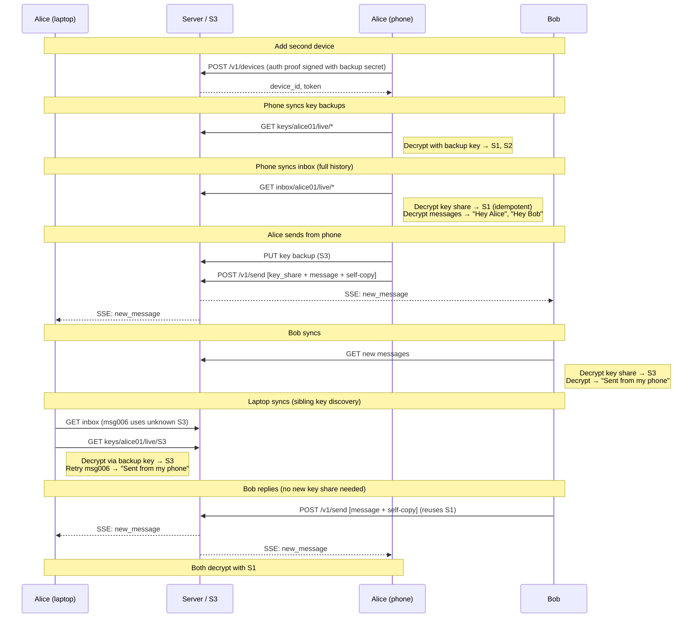

# Scenario: Multi-device

Alice adds a second device, syncs history, and both devices stay in sync going forward.

**Prerequisite**: [First conversation](./first-conversation.md) completed.

## Overview


Alice has a laptop (`adev01`), Bob has his device (`bdev01`).

## Cast

- **Alice** — adds her phone as a second device
- **Bob** — already in conversation with Alice

## Starting S3 state

```
users/alice01/profile.json
users/alice01/devices/adev01.json
users/bob01/profile.json
users/bob01/devices/bdev01.json

handles/alice-xyz.json
handles/bob-abc.json

inbox/alice01/live/msg001   ← key share from Bob (S1)
inbox/alice01/live/msg002   ← "Hey Alice" (S1)
inbox/alice01/live/msg004   ← "Hey Bob" (S2, self-copy)

inbox/bob01/live/msg002     ← "Hey Alice" (S1, self-copy)
inbox/bob01/live/msg003     ← key share from Alice (S2)
inbox/bob01/live/msg004     ← "Hey Bob" (S2)

keys/alice01/live/S1
keys/alice01/live/S2
keys/bob01/live/S1
```

## 1. Alice adds her phone

Alice opens the app on her phone, chooses "Add device", and enters her password.
The phone derives the same three keys (auth, sharing, backup) from the backup secret.

The phone generates a new device ID and signs an auth proof:

```
POST /v1/devices
{
  "user_id": "alice01",
  "device_label": "Alice's phone",
  "auth_proof": {
    "payload": { "user_id": "alice01", "device_id": "adev02", "timestamp": "2025-01-16T09:00:00Z" },
    "signature": "<Ed25519 signature>"
  }
}
→ { "device_id": "adev02", "token": "tok_a2" }
```

Server verifies the signature against `auth_public_key` in `users/alice01/profile.json`.

S3 writes:
- `users/alice01/devices/adev02.json` — `{ device_label: "Alice's phone" }`

Phone stores in IndexedDB: sharing private key, backup encryption key, device token.
Backup secret is discarded from memory.

## 2. Phone syncs key backups

```
GET /v1/store/list?prefix=keys/alice01/live/
→ ["keys/alice01/live/S1", "keys/alice01/live/S2"]

GET /v1/store/object?key=keys/alice01/live/S1
GET /v1/store/object?key=keys/alice01/live/S2
```

Phone decrypts each with the backup encryption key → recovers Megolm session keys S1 and S2.
Stores them in IndexedDB.

## 3. Phone syncs inbox (history)

```
GET /v1/store/list?prefix=inbox/alice01/live/
→ ["inbox/alice01/live/msg001", "inbox/alice01/live/msg002", "inbox/alice01/live/msg004"]

GET /v1/store/object?key=inbox/alice01/live/msg001
GET /v1/store/object?key=inbox/alice01/live/msg002
GET /v1/store/object?key=inbox/alice01/live/msg004
```

Processing:
1. `msg001` — `megolm.key_share`: phone decrypts with sharing private key → gets S1 (already have it from backup, idempotent).
2. `msg002` — `megolm.message` with S1: decrypts → "Hey Alice".
3. `msg004` — `megolm.message` with S2: decrypts → "Hey Bob" (self-copy).

Phone now has full chat history — identical to laptop.

## 4. Alice sends from phone ("Sent from my phone")

Phone creates its own Megolm session `S3` (each device has its own session).

**Key backup:**

```
POST /v1/store/presign
{ "key": "keys/alice01/live/S3", "bytes": 256 }
```

Phone needs Bob's sharing public key to send a key share.
It was cached from the envelope metadata, or fetched:

```
GET /v1/store/object?key=users/bob01/profile.json
```

**Send:**

```
POST /v1/send
{
  "envelopes": [
    {
      "to_user": "bob01", ...,
      "from_device": "adev02",
      "content_type": "megolm.key_share",
      "msg_id": "msg005",
      "payload": {
        "ephemeral_key": "<base64 P-256 pub, uncompressed SEC1>",
        "iv": "<base64>",
        "ciphertext": "<base64 ECIES(bob_sharing_pub, S3 session key)>"
      }
    },
    {
      "to_user": "bob01", ...,
      "from_device": "adev02",
      "content_type": "megolm.message",
      "msg_id": "msg006",
      "payload": {
        "session_id": "S3",
        "ciphertext": "<base64 Megolm(S3, {type: 'text', body: 'Sent from my phone'})>"
      }
    },
    {
      "to_user": "alice01", ...,
      "from_device": "adev02",
      "content_type": "megolm.message",
      "msg_id": "msg006",
      "payload": {
        "session_id": "S3",
        "ciphertext": "<base64 Megolm(S3, {type: 'text', body: 'Sent from my phone'})>"
      }
    }
  ]
}
```

S3 writes:
- `inbox/bob01/live/msg005` — key share for S3
- `inbox/bob01/live/msg006` — message
- `inbox/alice01/live/msg006` — self-copy
- `keys/alice01/live/S3` — key backup

## 5. Bob syncs

Bob's SSE connection (`GET /v1/events`) receives `new_message`:

```
GET /v1/store/list?prefix=inbox/bob01/live/&cursor=msg004
→ ["inbox/bob01/live/msg005", "inbox/bob01/live/msg006"]
```

Processing:
1. `msg005` — `megolm.key_share`: Bob decrypts with his sharing private key → gets S3.
   Writes to key backup: `keys/bob01/live/S3`.
2. `msg006` — `megolm.message` with S3: decrypts → "Sent from my phone".

Bob sees the message from Alice's phone. The `from_device: "adev02"` field
lets Bob's UI show it came from a different device (if desired).

## 6. Laptop syncs (sibling device key discovery)

Laptop's SSE connection receives `new_message`. Laptop syncs inbox:

```
GET /v1/store/list?prefix=inbox/alice01/live/&cursor=msg004
→ ["inbox/alice01/live/msg006"]

GET /v1/store/object?key=inbox/alice01/live/msg006
```

`msg006` uses session S3 — laptop doesn't have this key yet.
Laptop syncs key backup to find keys from sibling devices:

```
GET /v1/store/list?prefix=keys/alice01/live/
→ ["keys/alice01/live/S1", "keys/alice01/live/S2", "keys/alice01/live/S3"]

GET /v1/store/object?key=keys/alice01/live/S3
```

Decrypts with backup encryption key → recovers S3. Retries `msg006` → "Sent from my phone".

This is the core multi-device sync pattern: when a message can't be decrypted,
sync the key backup for new keys from sibling devices.

## 7. Bob replies ("Got it!")

Bob is still using session S1 (under 100 messages, no rotation yet).
All of Alice's devices already have S1 — no new key share needed.

```
POST /v1/send
{
  "envelopes": [
    {
      "to_user": "alice01", ...,
      "content_type": "megolm.message",
      "msg_id": "msg007",
      "payload": {
        "session_id": "S1",
        "ciphertext": "<base64 Megolm(S1, {type: 'text', body: 'Got it!'})>"
      }
    },
    {
      "to_user": "bob01", ...,
      "content_type": "megolm.message",
      "msg_id": "msg007",
      "payload": {
        "session_id": "S1",
        "ciphertext": "<base64 Megolm(S1, {type: 'text', body: 'Got it!'})>"
      }
    }
  ]
}
```

Both Alice's laptop and phone receive `new_message` via SSE, sync, and decrypt
`msg007` with S1. No key share, no key backup sync — they both already have the key.

## S3 state after scenario

```
users/alice01/profile.json
users/alice01/devices/adev01.json
users/alice01/devices/adev02.json       ← new
users/bob01/profile.json
users/bob01/devices/bdev01.json

handles/alice-xyz.json
handles/bob-abc.json

inbox/alice01/live/msg001   ← key share from Bob (S1)
inbox/alice01/live/msg002   ← "Hey Alice"
inbox/alice01/live/msg004   ← "Hey Bob" (self-copy)
inbox/alice01/live/msg006   ← "Sent from my phone" (self-copy)
inbox/alice01/live/msg007   ← "Got it!"

inbox/bob01/live/msg002     ← "Hey Alice" (self-copy)
inbox/bob01/live/msg003     ← key share from Alice (S2)
inbox/bob01/live/msg004     ← "Hey Bob"
inbox/bob01/live/msg005     ← key share from Alice phone (S3)
inbox/bob01/live/msg006     ← "Sent from my phone"
inbox/bob01/live/msg007     ← "Got it!" (self-copy)

keys/alice01/live/S1
keys/alice01/live/S2
keys/alice01/live/S3            ← new (phone's session)
keys/bob01/live/S1
keys/bob01/live/S3              ← new (received from phone)
```

## What to test

- Phone derives identical keys from the password (auth proof verifies).
- Phone decrypts full history after key backup + inbox sync.
- Bob receives and decrypts messages from Alice's phone (different session, different `from_device`).
- Laptop discovers phone's session key via key backup when it encounters an unknown session.
- Both devices decrypt Bob's reply without any new key exchange.
- `msg_id` de-duplication: key share S1 from inbox is harmless when already restored from backup.
