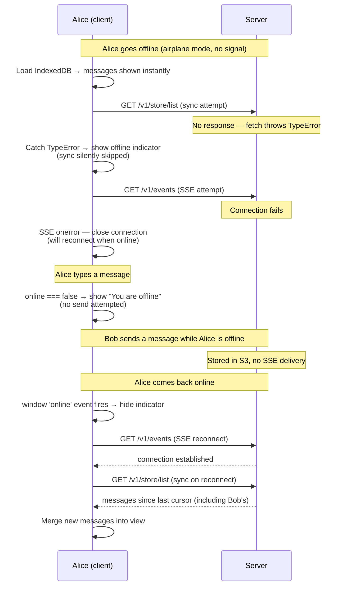

# Scenario: Offline mode

Alice's device loses network access. She sees her cached message history
immediately, is informed she is offline, and resumes normally when
connectivity returns.

## Overview

## Cast

- **Alice** — goes offline and returns
- **Bob** — sends a message while Alice is offline

## Offline detection

The client uses two signals:

- **`navigator.onLine`** — read on mount to set the initial state.
- **`window` `online` / `offline` events** — update state at runtime.

A dedicated hook (`useOnlineStatus`) returns a boolean `online`. Components
do not poll or use timers — the browser events are the only source of truth.

## Message display while offline

`useChat` loads IndexedDB before attempting a server sync. No change is
needed for reads: Alice sees all previously synced messages the moment the
component mounts, regardless of connectivity.

## Sync while offline

The sync inside `loadAndSync` may throw a `TypeError` when `fetch` fails
with no network. The catch block distinguishes:

- `TypeError` (no network) → skip sync silently; the cached view is
  sufficient. The offline indicator is shown.
- `APIError` with `status === 401` → delegate to `onUnauthorized` (see
  [Invalid token](./invalid-token.md)). This path is unaffected by offline
  state.
- Other errors → log to console, skip sync.

No error toast is shown for a failed sync while offline — the indicator is
enough.

## SSE while offline

`EventSource` natively retries transient failures. The offline behaviour is:

1. On `onerror` while `online === false`: close the connection, take no
   further action.
2. The SSE `useEffect` in `useChat` lists `online` as a dependency. When
   `online` transitions `false → true`, the effect re-runs: a new
   `EventSource` is opened and a sync is triggered immediately to catch
   messages received while offline.

No manual reconnect timers are needed. The dependency on `online` is the
entire reconnect mechanism.

## Sending while offline

A send attempt while `online === false` is rejected before any encryption
or network call. The UI shows a "You are offline" error message. No message
is enqueued.

**Why no outbox queue**: Megolm's ratchet advances on `encrypt()`, before
the server confirms receipt. A queued ciphertext whose send subsequently
fails is at a ratchet index that has already been consumed. On a manual
retry, the next `encrypt()` produces a ciphertext at a higher index —
recipients can still decrypt it (the ratchet is forward-only), but managing
a queue of pre-encrypted payloads and their ratchet positions adds
meaningful complexity. An explicit user retry after reconnecting is simpler
and equally correct.

## S3 state

No S3 state changes during the offline period. Messages sent by others
accumulate in their recipients' S3 inboxes normally. Alice's sync cursor
is unchanged until she comes back online and syncs successfully.

## What to test

- On load with no network: IndexedDB messages are shown; offline indicator
  is visible; no uncaught error.
- Sync failure (`TypeError`) is caught; the component does not crash.
- SSE `onerror` while offline closes the connection without error.
- When `online` fires, a new SSE connection opens automatically.
- A sync runs immediately after SSE reconnects; messages sent while
  offline become visible.
- Sending while offline shows "You are offline"; no message is lost or
  duplicated.
- Sending after reconnect succeeds normally.
- The offline indicator disappears when `online` fires.
