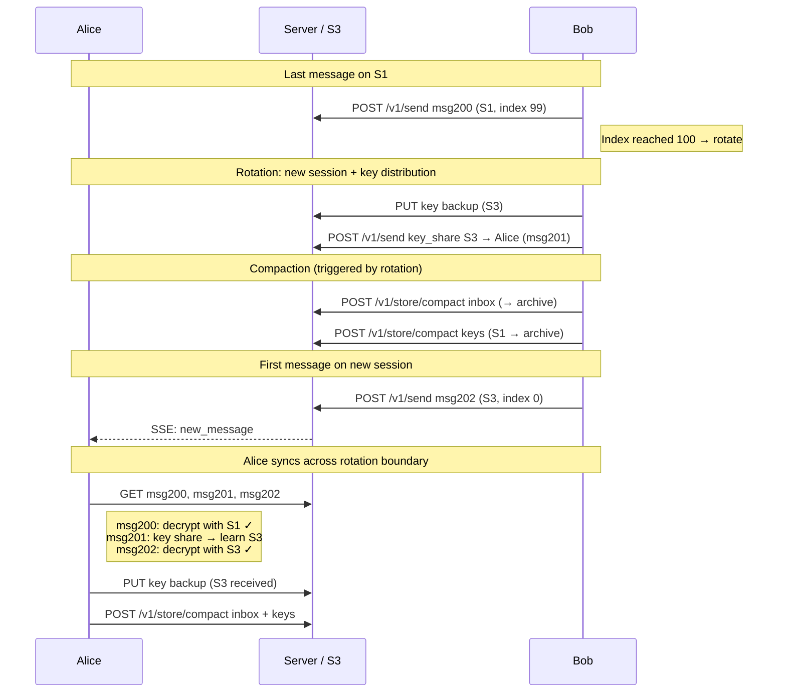

# Scenario: Session rotation

Bob hits the 100-message limit on his Megolm session, triggering rotation,
key distribution, key backup, and compaction.

**Prerequisite**: [First conversation](./first-conversation.md) completed.

## Overview


Bob has session S1 (message index at 99 after many messages).
Alice has session S2.

## Cast

- **Alice** — receives messages across the rotation boundary
- **Bob** — hits 100-message limit, rotates session

## Starting S3 state (simplified)

```
users/alice01/profile.json
users/alice01/devices/adev01.json
users/bob01/profile.json
users/bob01/devices/bdev01.json

inbox/alice01/live/msg001                  ← key share from Bob (S1)
inbox/alice01/live/msg002..msg100          ← 99 messages from Bob (S1)
inbox/alice01/live/msg101..msg150          ← messages from Alice (S2, self-copies)

inbox/bob01/live/msg002..msg100            ← 99 messages (S1, self-copies)
inbox/bob01/live/msg101                    ← key share from Alice (S2)
inbox/bob01/live/msg102..msg150            ← messages from Alice (S2)

keys/alice01/live/S1
keys/alice01/live/S2
keys/bob01/live/S1
```

Bob's session S1 has message index 99 (0-indexed). The next message triggers rotation.

## 1. Bob sends message 100 (last on S1)

Bob's client encrypts with S1 at message index 99:

```
POST /v1/send
{
  "envelopes": [
    {
      "to_user": "alice01", ...,
      "content_type": "megolm.message",
      "msg_id": "msg200",
      "payload": { "session_id": "S1", "ciphertext": "<Megolm(S1[99], 'Message 100')>" }
    },
    { "to_user": "bob01", ..., "msg_id": "msg200", ... }
  ]
}
```

After sending, Bob's client detects: message index has reached 100.
Time to rotate.

## 2. Bob creates new session and distributes keys

Bob's client creates a new Megolm session `S3`.

**Key backup** (write new session key to backup before first use):

```
POST /v1/store/presign
{ "key": "keys/bob01/live/S3", "bytes": 256 }

PUT <presigned_url>
← {"iv": "<base64>", "ciphertext": "<base64 AES-256-GCM of S3 session key>"}
```

**Key share to Alice:**

```
POST /v1/send
{
  "envelopes": [
    {
      "to_user": "alice01", ...,
      "content_type": "megolm.key_share",
      "msg_id": "msg201",
      "payload": {
        "ephemeral_key": "<base64 P-256 pub, uncompressed SEC1>",
        "iv": "<base64>",
        "ciphertext": "<base64 ECIES(alice_sharing_pub, S3 session key)>"
      }
    }
  ]
}
```

S3 writes:
- `keys/bob01/live/S3` — key backup
- `inbox/alice01/live/msg201` — key share for S3

## 3. Bob triggers compaction

Rotation is a natural compaction point. Bob's client requests compaction
of his inbox and key backups up to the current cursor:

```
POST /v1/store/compact
{ "prefix": "inbox/bob01/live/", "up_to": "msg200" }
```

Server:
1. Lists `inbox/bob01/live/msg002` through `inbox/bob01/live/msg200`.
2. Lists existing same-day archives (none on first compaction of the day).
3. Reads all live objects, encodes as CBOR array.
4. Writes `inbox/bob01/archive/2025-01-15-{ULID}`.
5. Deletes the compacted live objects.

If a same-day archive already existed, the server merges its contents with the
new objects, deduplicates by `msg_id`, and writes a single replacement archive.

```
POST /v1/store/compact
{ "prefix": "keys/bob01/live/", "up_to": "S1" }
```

Server:
1. Reads `keys/bob01/live/S1`.
2. Writes `keys/bob01/archive/2025-01-15-{ULID}`.
3. Deletes `keys/bob01/live/S1`.

S3 state change:
- `inbox/bob01/live/msg002..msg200` → `inbox/bob01/archive/2025-01-15-{ULID}`
- `keys/bob01/live/S1` → `keys/bob01/archive/2025-01-15-{ULID}`
- `inbox/bob01/live/` now empty (until next sync)
- `keys/bob01/live/S3` remains (current session, not compacted)

## 4. Bob sends first message on new session

```
POST /v1/send
{
  "envelopes": [
    {
      "to_user": "alice01", ...,
      "content_type": "megolm.message",
      "msg_id": "msg202",
      "payload": { "session_id": "S3", "ciphertext": "<Megolm(S3[0], 'First on new session')>" }
    },
    { "to_user": "bob01", ..., "msg_id": "msg202", ... }
  ]
}
```

Message index resets to 0 on the new session.

## 5. Alice syncs

Alice's client syncs inbox:

```
GET /v1/store/list?prefix=inbox/alice01/live/&cursor=msg150
→ ["inbox/alice01/live/msg200", "inbox/alice01/live/msg201", "inbox/alice01/live/msg202"]

GET /v1/store/object?key=inbox/alice01/live/msg200
GET /v1/store/object?key=inbox/alice01/live/msg201
GET /v1/store/object?key=inbox/alice01/live/msg202
```

Processing:
1. `msg200` — `megolm.message` with S1: decrypts → "Message 100". (Alice still has S1.)
2. `msg201` — `megolm.key_share`: Alice decrypts with sharing private key → gets S3.
   Writes to key backup: `keys/alice01/live/S3`.
3. `msg202` — `megolm.message` with S3: decrypts → "First on new session".

Seamless transition. Alice's client does not need to know about rotation —
it just processes key shares as they arrive.

## 6. Alice also triggers compaction

Alice compacts her inbox and key backups:

```
POST /v1/store/compact
{ "prefix": "inbox/alice01/live/", "up_to": "msg200" }

POST /v1/store/compact
{ "prefix": "keys/alice01/live/", "up_to": "S1" }
```

Both sides have now archived pre-rotation data.

## S3 state after scenario

```
users/alice01/profile.json
users/alice01/devices/adev01.json
users/bob01/profile.json
users/bob01/devices/bdev01.json

inbox/alice01/archive/2025-01-15-{ULID}    ← CBOR: msg001..msg200
inbox/alice01/live/msg201                  ← key share (S3)
inbox/alice01/live/msg202                  ← "First on new session"

inbox/bob01/archive/2025-01-15-{ULID}      ← CBOR: msg002..msg200
inbox/bob01/live/msg202                    ← "First on new session" (self-copy)

keys/alice01/archive/2025-01-15-{ULID}  ← CBOR: S1
keys/alice01/live/S2
keys/alice01/live/S3               ← new (received from Bob)
keys/bob01/archive/2025-01-15-{ULID}    ← CBOR: S1
keys/bob01/live/S3                 ← current session
```

## Security properties

- **Forward secrecy**: S1's ratchet state at index 100 cannot derive keys for indices 0–99.
  Even if S3 is later compromised, messages encrypted with S1 remain safe.
- **Clean handoff**: key share for S3 (msg201) has a ULID between msg200 (last S1 message)
  and msg202 (first S3 message). ULID ordering guarantees Alice processes the key share
  before the first message that needs it.
- **Compaction is safe**: key backup for S1 exists in archive before live objects are deleted.
  A crash between archive write and live delete causes duplicates, not data loss.

## What to test

- 100th message on a session triggers rotation (new session created).
- Key share for new session is sent before any message using it.
- Key backup is written before the first message on the new session.
- Alice decrypts messages across the rotation boundary (S1 → S3) seamlessly.
- Compaction archives live objects; archived data is readable.
- Compacted key backups are recoverable (tested via account-recovery scenario).
- Message index resets to 0 on new session.
- Old session (S1) can still decrypt old messages (no key deletion).
- Concurrent compaction by both parties is idempotent.
