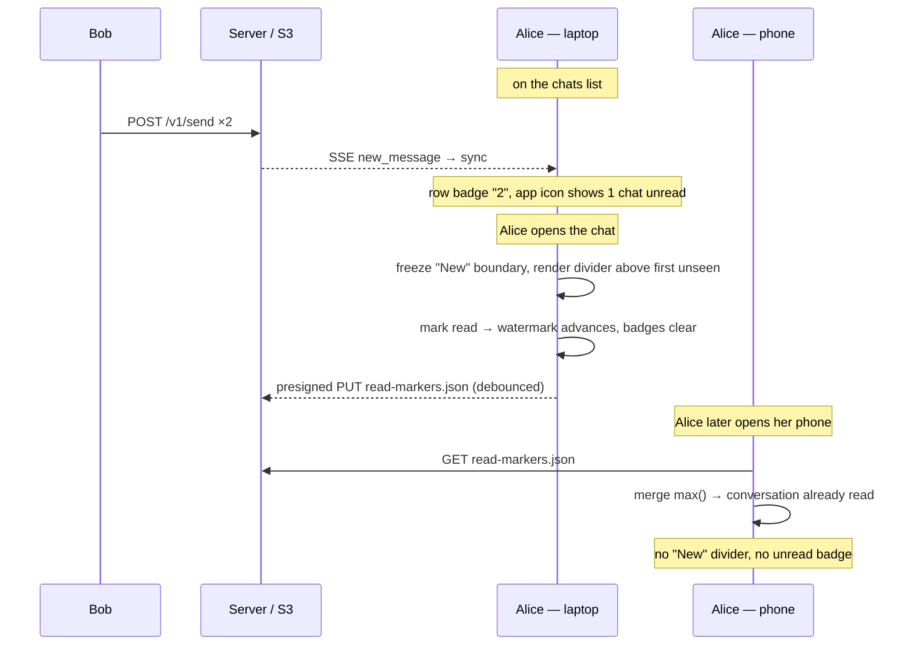

# Scenario: Unread messages — badges, the "New" divider, cross-device sync

Alice has unseen messages and needs to know it. Three surfaces tell her, all
driven by one piece of state — a per-conversation **read watermark** (the
timestamp of the newest message she's seen):

- the **chats list** shows a per-row count of unread incoming messages;
- the installed **app icon** shows how many conversations have anything unread;
- inside a conversation, a **`── New ──` divider** sits above the first message
  she hasn't seen.

And because the watermark **syncs across her devices** (zero-knowledge), reading
on her phone clears the unread on her laptop — no plethora of fake "new" when she
switches devices.

This is **self-state, not a read receipt**: it answers "what haven't *I* seen,"
and is never signalled to the peer (read receipts remain a
[vision.md](../vision.md) non-goal). The sync model, the encrypted
`read-markers.json` blob, and the monotone `max()` merge are specified in
[ADR-0026](../decisions/adr-0026-cross-device-read-markers.md).

## Overview

## Cast

- **Bob** — sends messages to Alice.
- **Alice (laptop)** — sees the unread badge + count, opens the chat, reads.
- **Alice (phone)** — a second device that catches up automatically.

## 1. Bob sends; Alice sees unread without opening

Alice is on her chats list (the chat with Bob need not exist yet). Bob sends two
messages. Alice's foreground sync ([useInboxSync](../../web/src/hooks/useInboxSync.ts)
→ `syncAndPublish`) materializes them into IndexedDB, creating the conversation
row with **no** read watermark yet.

- The chats row for Bob shows an unread badge reading **`2`** (incoming messages
  only — Alice's own sends never count, nor does Saved Messages).
- The app icon (installed PWA) shows **`1`** — one conversation has something
  unread. Counted via `navigator.setAppBadge`, feature-detected; a no-op in
  browsers without the Badging API (e.g. Firefox).

## 2. Alice opens the chat — the "New" divider

Opening the conversation freezes the read boundary **once**, at the watermark as
it stood on open, then marks the conversation read. The timeline renders a
full-width **`── New ──`** divider immediately above the first incoming message
newer than that boundary.

- A message that arrives *while the chat is open* lands **below** the divider
  (it's marked read, but the divider's frozen position holds until the next
  open) — the Slack behaviour.
- The divider shows only when at least one incoming message is past the boundary;
  a fully-read conversation (and Saved Messages, which has no incoming) shows
  none.

Marking read advances the watermark to the newest message. The chats-row badge
and the app-icon count both clear.

## 3. The read syncs to Alice's other devices

Marking read schedules a **debounced** encrypted upload of `read-markers.json`
(coalesced — opening five chats is one upload, never one-per-message). Offline,
the local state still updates and the upload flushes on the next online sync.

When Alice opens her **phone**, its first foreground sync GETs the blob and
merges it into local read state by per-conversation `max()`. The conversation
Alice already read on the laptop is **not** shown as new: no `── New ──` divider,
no unread badge. The merge is immune to clock skew between her devices because
the watermark is the *message's* timestamp, not a wall-clock-at-read.

## Server / S3 effects

- `users/{uid}/read-markers.json` — one client-encrypted blob (AES-256-GCM under
  the backup key, same envelope as `contacts.json`). The server stores opaque
  ciphertext and learns only that a blob changed — never which chats exist or
  where Alice has read. No new endpoint: the generic presign + object routes and
  the existing `users/{uid}/*` write authorization already cover it.
- No inbox, key, or profile object is touched. Unread tracking adds **no**
  message-protocol state.

## Known limitation — the app icon is "fresh as of last open"

`setAppBadge` can only run while Alice's app is running. With the app closed the
SSE connection is down, so the icon badge is frozen at its last foreground value;
it does not update for messages that arrive while the app is closed. Refreshing
it in the background needs a wake-up mechanism (Web Push / native), which
[ADR-0015](../decisions/adr-0015-web-push.md) deliberately defers to the
native-apps track. This is behaviour, not a bug: the in-app badges and the `New`
divider are always correct on the next open.

## Tests

- E2E: [`web/e2e/unread.spec.ts`](../../web/e2e/unread.spec.ts) — row badge count,
  the `New` divider appearing then clearing on read, and a two-device flow proving
  a read on one device clears the unread on the other (no fake "new").
- Unit: `mergeMarkers` CRDT laws + `syncReadMarkers` convergence
  ([read-markers.test.ts](../../web/src/lib/read-markers.test.ts)); `unreadCounts`,
  `markConversationRead`, and the v9→v10 backfill ([db.test.ts](../../web/src/lib/db.test.ts)).
